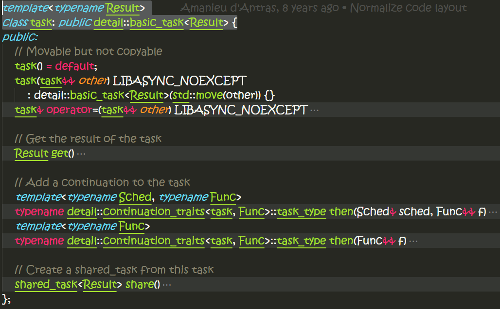
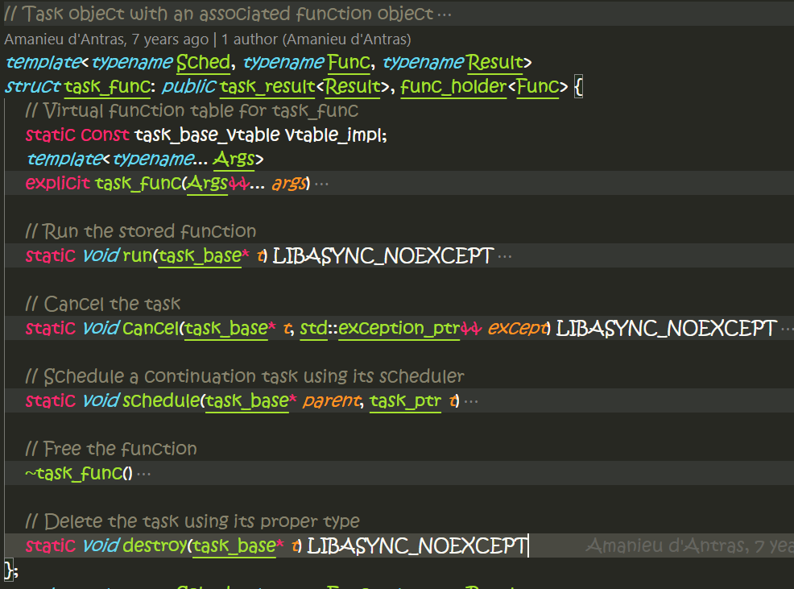
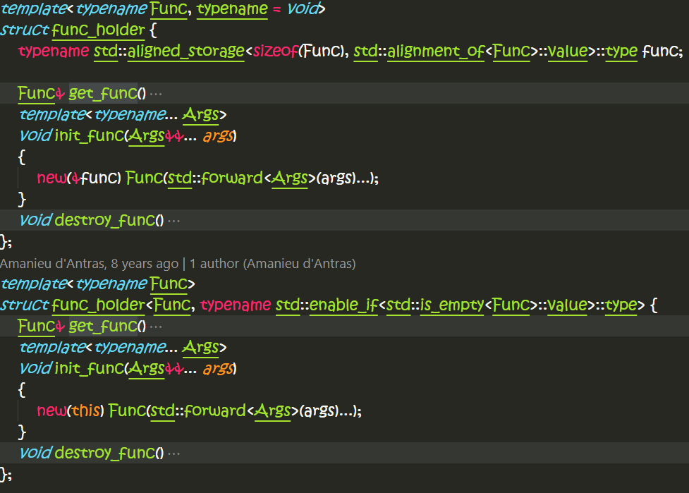
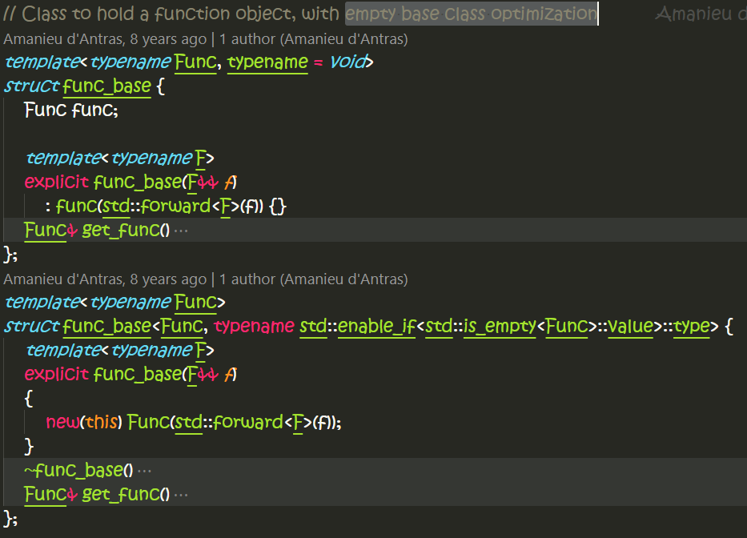
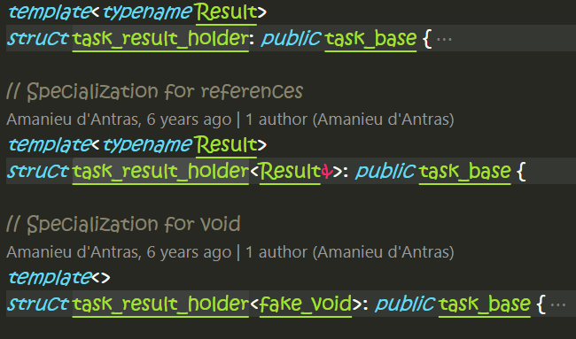
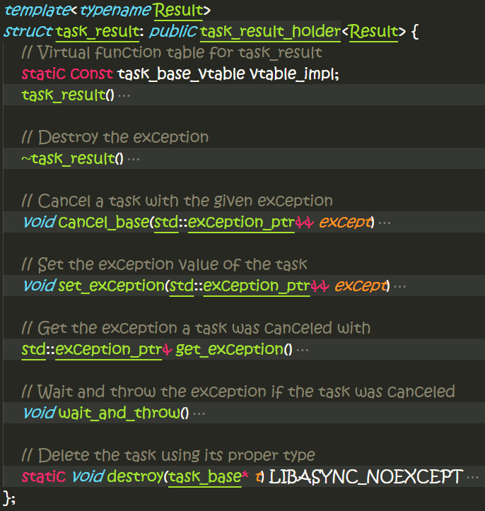
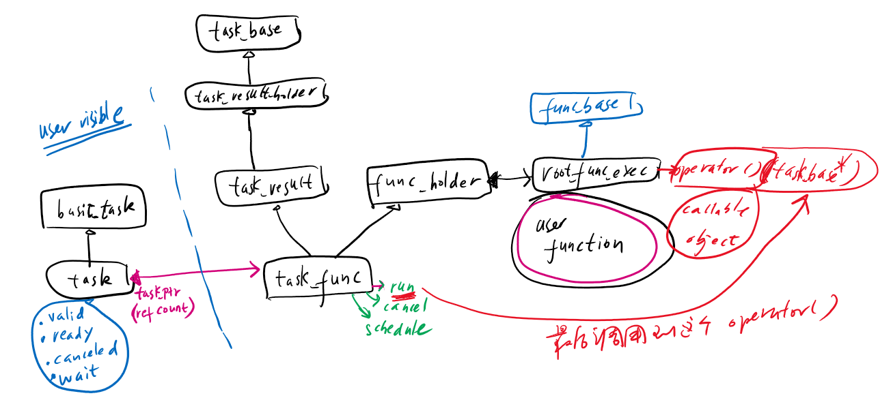

# task类的学习

文件
======
- include\async++\task.h
- include\async++\task_base.h

task类
======
```task<typename detail::remove_task<decltype(std::declval<decay_func>()())>::type> out;```
> 这个类的模板参数要求是decay-ed之后的callable object调用的返回值类型。
```CPP {.numberLines}
template<typename Result>
class task: public detail::basic_task<Result> {
```
具体的接口定义如下：

- 只支持movable，不支持copyable
- 通过`get`获取结果
- 通过`then`接口支持task continuation
- 通过`share`接口`shared_task`

如果父类只支持movable，那么子类编写的movable的接口函数样式如下：
```CPP {.numberLines}
task(task&& other) LIBASYNC_NOEXCEPT
    : detail::basic_task<Result>(std::move(other)) {}
task& operator=(task&& other) LIBASYNC_NOEXCEPT
{
    detail::basic_task<Result>::operator=(std::move(other));
    return *this;
}
```
注意要转调到父类的move ctor和move assignment，采用std::move utility函数。

`task`类继承于模板类`basic_task`，它是对`detail::task_ptr internal_task;`的封装，而`task_ptr`就是`typedef ref_count_ptr<task_base> task_ptr;`的typedef。重新copy之前spawn的代码片段：
```CPP {.numberLines}
task<typename detail::remove_task<decltype(std::declval<decay_func>()())>::type> out;
detail::set_internal_task(out, detail::task_ptr(new detail::task_func<Sched, exec_func, internal_result>(std::forward<Func>(f))));
```
- 创建一个`task`，然后设置一个task_ptr给`out`。这个task_ptr就是ref_count_ptr（类似于std::shared_ptr);
- 用户的代码块被封装到一个叫做`task_func`的类里面；
- `set_internal_task`和`get_internal_task`都是utility函数，定义为基类`basic_task`的友元函数：
    ```CPP {.numberLines}
    template<typename Result>
    class basic_task {
	    // Reference counted internal task object
	    detail::task_ptr internal_task;

        template<typename T>
	    friend typename T::internal_task_type* get_internal_task(const T& t);
	    template<typename T>
	    friend void set_internal_task(T& t, task_ptr p);
    ```
    ```CPP {.numberLines}
    // Real result type, with void turned into fake_void
	typedef typename void_to_fake_void<Result>::type internal_result;
    // Type-specific task object
	typedef task_result<internal_result> internal_task_type;
    ```
    > `internal_task_type`是一个定义在`basic_task`里面的内嵌类型

`basic_task`类
========
父类`basic_task`提供的接口比较干净：
```CPP {.numberLines}
// Check if this task is not empty
bool valid() const
// Query whether the task has finished executing
bool ready() const
// Query whether the task has been canceled with an exception
bool canceled() const
// Wait for the task to complete
void wait() const
// Get the exception associated with a canceled task
std::exception_ptr get_exception() const
```
它的`get_internal`函数比较精简：
```CPP {.numberLines}
void get_internal() const
{
    // If the task was canceled, throw the associated exception
    get_internal_task(*this)->wait_and_throw();
}
```
`internal_task_type`是一个`task_result`类型，调用它的`wait_and_throw`函数

`task_func`类
========

```CPP {.numberLines}
	// Create task
	typedef typename detail::void_to_fake_void<typename detail::remove_task<decltype(std::declval<decay_func>()())>::type>::type internal_result;
	typedef detail::root_exec_func<Sched, internal_result, decay_func, detail::is_task<decltype(std::declval<decay_func>()())>::value> exec_func;
	task<typename detail::remove_task<decltype(std::declval<decay_func>()())>::type> out;
	detail::set_internal_task(out, detail::task_ptr(new detail::task_func<Sched, exec_func, internal_result>(std::forward<Func>(f))));
```
- 定义在task_base.h文件中
- 模板参数`Func`就是前面提供的`exec_func`类型，下面的代码会将用户的代码函数`f`重新包装成一个`exec_func`
  ```CPP {.numberLines}
  	template<typename... Args>
	explicit task_func(Args&&... args)
	{
		this->vtable = &vtable_impl;
		this->init_func(std::forward<Args>(args)...);
	}
  ```
看下面的代码：
```CPP {.numberLines}
template<typename Func>
struct func_holder<Func, typename std::enable_if<std::is_empty<Func>::value>::type> {
	Func& get_func()
	{
		return *reinterpret_cast<Func*>(this);
	}
	template<typename... Args>
	void init_func(Args&&... args)
	{
		new(this) Func(std::forward<Args>(args)...);
	}
	void destroy_func()
	{
		get_func().~Func();
	}
};
```
`task_func`继承于`task_result<Result>`和`func_holder<Func>`，在它的构造函数里面，它调用`init_func`函数在这个父类func_holder的地址空间中构造了一个`Func`（也就是`exec_func`）。有了这个包装类，我们就可以控制func对象生命期了: new/delete
task_base.h里面很多类都采用了一种特别的技术来实现c++的virtual function/table的机制，`task_func`就是其中之一 **（TODO: 理解下这种机制，写下学习笔记）**
现在可以简单的理解`task_func`目的之一就是对用户的代码函数进行封装和调用。
它的run接口：
```CPP {.numberLines}
// Run the stored function
static void run(task_base* t) LIBASYNC_NOEXCEPT
{
    LIBASYNC_TRY {
        // Dispatch to execution function
        static_cast<task_func<Sched, Func, Result>*>(t)->get_func()(t);
    } LIBASYNC_CATCH(...) {
        cancel(t, std::current_exception());
    }
}
```
- 被定义为静态函数。而不是虚函数，这是采用上面所说的那种技术的结果。假设第一个参数`task_base`就是`this`指针；
- 将`t`强转为`task_func`类型指针，然后在其上调用`get_func()`函数，返回underlying function，传入`t`作为第一参数进行调用。`get_func`函数返回的就是前面封装的`Func`对象。
- catch所有异常

func_holder类
=======

- 这个类采用std::enable_if进行特化处理。如果`Func`类型是空类型(std::is_empty返回true)，不占用存储空间，直接在`func_holder`的地址空间构造用户的`f`，否则，在aligned_storage上构造那个`Func`对象，地址align到sizeof(Func)
  ```CPP {.numberLines}
  typename std::aligned_storage<sizeof(Func), std::alignment_of<Func>::value>::type func;
  new(&func) Func(std::forward<Args>(args)...);
  ```
- 这是一种叫做**empty base class optimization**的技术
下面这个类的定义可能更能清楚的描述这种技术

如果我们直接在`func_base`类里面定义`Func func`，那么不管`sizeof(Func)`是否为空，当这个`func_base`类作为基类时，这个`func_base`就会占用空间。而采用上述的技术，`sizeof(func_base)`将会为空，在子类sizeof计算中就不会有来自基类空间大小。
```CPP {.numberLines}
template<typename Func, typename = void>
struct func_base {
	Func func;

	template<typename F>
	explicit func_base(F&& f)
		: func(std::forward<F>(f)) {}
	Func& get_func()
	{
		return func;
	}
};
template<typename Func>
struct func_base<Func, typename std::enable_if<std::is_empty<Func>::value>::type> {
	template<typename F>
	explicit func_base(F&& f)
	{
		new(this) Func(std::forward<F>(f));
	}
	~func_base()
	{
		get_func().~Func();
	}
	Func& get_func()
	{
		return *reinterpret_cast<Func*>(this);
	}
};
```

task_result类
=======


- `task_result`类继承于`task_result_holder`类；
- `task_result_holder`类继承于`task_base`类 （抓到你了~~)；
- 所以前面的`task_func`类就继承于`task_base`类，换句话说，`task`类内含一个`task_base`对象，这个对象就是对用户代码函数的封装；

task_base类
=======
```struct task_base: public ref_count_base<task_base, task_base_deleter>```
> task_base类继承于ref_count_base，采用引用计数进行管理
```CPP {.numberLines}
// Use aligned memory allocation
static void* operator new(std::size_t size)
{
    return aligned_alloc(size, LIBASYNC_CACHELINE_SIZE);
}
static void operator delete(void* ptr)
{
    aligned_free(ptr);
}
```
> - 采用aligned memory 来提供类定制的new/delete
> - 关于`LIBASYNC_CACHELINE_SIZE`技术，**TODO**

`root_exec_func`类
=======
```CPP {.numberLines}
template<typename Sched, typename Result, typename Func, bool Unwrap>
struct root_exec_func: private func_base<Func> {
	template<typename F>
	explicit root_exec_func(F&& f)
		: func_base<Func>(std::forward<F>(f)) {}
	void operator()(task_base* t)
	{
		static_cast<task_result<Result>*>(t)->set_result(detail::invoke_fake_void(std::move(this->get_func())));
		static_cast<task_func<Sched, root_exec_func, Result>*>(t)->destroy_func();
		t->finish();
	}
};
template<typename Sched, typename Result, typename Func>
struct root_exec_func<Sched, Result, Func, true>: private func_base<Func> {
	template<typename F>
	explicit root_exec_func(F&& f)
		: func_base<Func>(std::forward<F>(f)) {}
	void operator()(task_base* t)
	{
		unwrapped_finish<Sched, Result, root_exec_func>(t, std::move(this->get_func())());
	}
};
```
- 这个类就是之前wrap用户代码函数的类型`Func`，进而被包装到`func_holder`类里面；
- `task_func`类的`run`函数最终就会调到这个`root_exec_func`的operator()函数，不管是直接调用，还是线程池schedule调用；
- wrap版本将用户代码函数传入`invoke_fake_void`进行调用，然后设置结果到task_result中；
- 之后销毁用户代码函数对象；
- 调用task_base的`finish`函数，设置task完成状态，同时触发continuation task的schedule运行；
    ```CPP {.numberLines}
	// Finish the task after it has been executed and the result set
	void finish()
	{
		state.store(task_state::completed, std::memory_order_release);
		run_continuations();
	}
    // Run all of the task's continuations after it has completed or canceled.
	// The list of continuations is emptied and locked to prevent any further
	// continuations from being added.
	void run_continuations()
	{
		continuations.flush_and_lock([this](task_ptr t) {
			const task_base_vtable* vtable = t->vtable;
			vtable->schedule(this, std::move(t));
		});
	}
    ```

how to schedule task via scheduler?
==============
```CPP {.numberLines}
// Avoid an expensive ref-count modification since the task isn't shared yet
detail::get_internal_task(out)->add_ref_unlocked();
detail::schedule_task(sched, detail::task_ptr(detail::get_internal_task(out)));

// Schedule a task for execution using its scheduler
template<typename Sched>
void schedule_task(Sched& sched, task_ptr t)
{
    static_assert(is_scheduler<Sched>::value, "Type is not a valid scheduler");
    sched.schedule(task_run_handle(std::move(t)));
}
```

这个图描述的是task里面的类之间的关系

