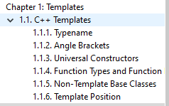

# 书<Advanced-Metaprogramming-in-Classic-C++>阅读笔记

**""C++supports a variety of styles."**

1.1 Templates/C++ Templates
===
1.1节的目录如下:


这节的内容对C++中模板知识点进行了概要性描述，相当精简。

给定一个C++的代码片段：
```c++
double x = sq(3.14);
```
这里的`sq`有可能是以下几种情况：
* 宏实现:
`#define sq(x) ((x) * (x))`
* 一个函数：
```c++
double sq(double x)
{
    return x * x;
}
```
* 一个函数模板：
```c++
template <typename scalar_t>
inline scalar_t sq(const scalar_t& x)
{
    return x * x;
}
```
* 一个类型，这个类型可以自动转化为一个double类型
```c++
class sq
{
    double s_;
public:
    sq(double x) : s_(x * x) { }
    operator double() const { return s_; }
};
```
* 一个全局函数对象(functor):
```c++
class sq_t
{
public：
    typedef double value_type;
    value_type operator()(double x) const
    {
        return x * x;
    }
};
const sq_t sq = sq_t();
```

**the true power of C++ templates is style**


