# 书<C++编程惯用法>阅读笔记

第3章： 句柄
===

数据抽象给我们带来的一个主要好处就是：对象的物理结构没有必要反映出它的抽象结构来。
我们展示给用户看的模型具有的某些物理属性也不一定需要以模型中的形式出现在实现中。
尤其是当抽象模型表示的是一个对象“包含”另外一个对象时，我们的实现也不需要将被包含的对象作为一个数据成员放置到包含它的对象中去，而可以让包含对象拥有一个用来表示被包含的句柄(handle)。从概念上来说，句柄是一个指向某种C++对象的指针，它通常也就是一个普通的C++指针。
句柄可以给我们带来如下的好处：
* 我们可以在实现中用尺寸大小固定对象来表示尺寸大小不定的值；
* 我们可以在实现中用运行时绑定而不是编译时绑定的方式来处理对象；
* 对于实现的改变通常只会引起一次重新链接，而不是重新编译；
* 我们可以对他人隐藏对象的实现；
不过有利必有弊，句柄的实现需要我们编写更多的代码，并且它会带来一些运行时的开销。

一个`String`类:
===
类的接口定义：
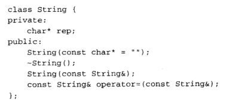

构造函数和析构函数：
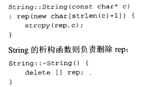

复制构造函数：
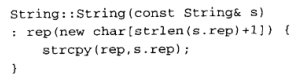

赋值操作符：
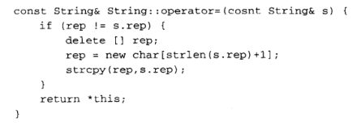

使用计数器来避免多份拷贝：
===
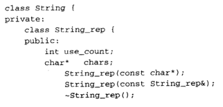
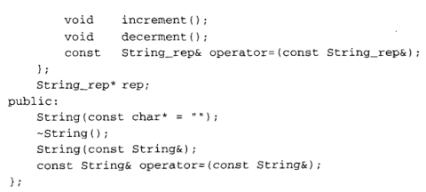
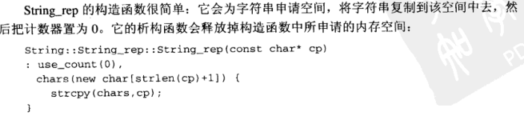
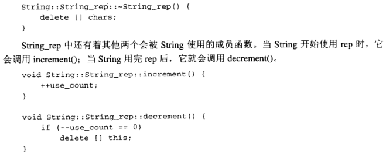
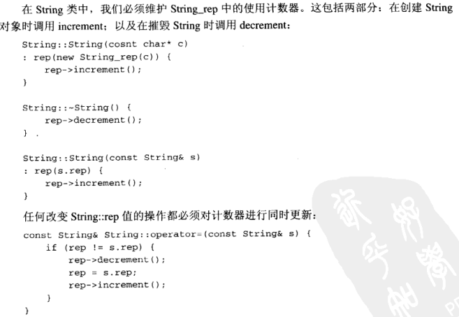
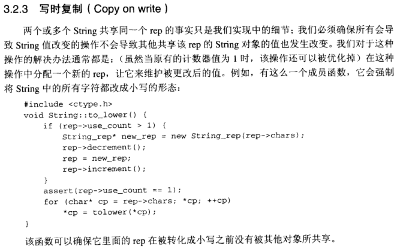

一个告诫：
===
使用计数器的类要比没有使用计数器但功能相同的类要复杂得多，并且所有围绕着该计数器得操作都将导致程序执行时间得显著增加。如果用来复制值得时间足够短（这可能是由于该值占据得空间很小，导致复制它得成本很低；也可能是因为我们很少去赋值它们），将类改为使用计数器得方式会导致程序的运行变慢。
由于使用计数器的好处来自于我们不需要赋值String中的字符串，我们可以预期：当字符串很大并且它们的值被经常复制时，使用计数器的那个类应该会在比较中占优。如果我们一直不去对String赋值，而只是对它进行创建和摧毁，那么使用计数器的那个类将会在比较中落败：对使用计数器的String进行创建和摧毁的操作要比没有使用计数器的那个String慢大概80%。于是我们得出结论：在本例中，使用了计数器的版本在某些程序中（其中对String的平均赋值超过一次）中要快一些，在其它程序中则要慢一些。

多种实现
===
当对象使用了句柄时，构造函数可以从几种不同的实现中来选择一种用于构建rep。例如我们可能会有两个不同的用于String的rep的实现：其中的一种速度比较快，但它只能处理那些比较短的字符串；另外一种要稍慢些，但它可以处理任意长度的字符串。我们就可以在String中构造函数中通过对字符串长度的判断来选择合适的实现。
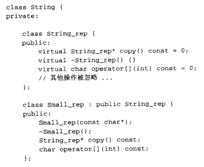
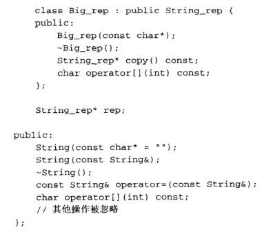
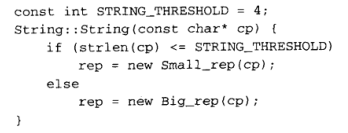
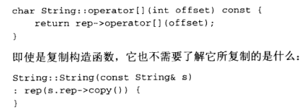
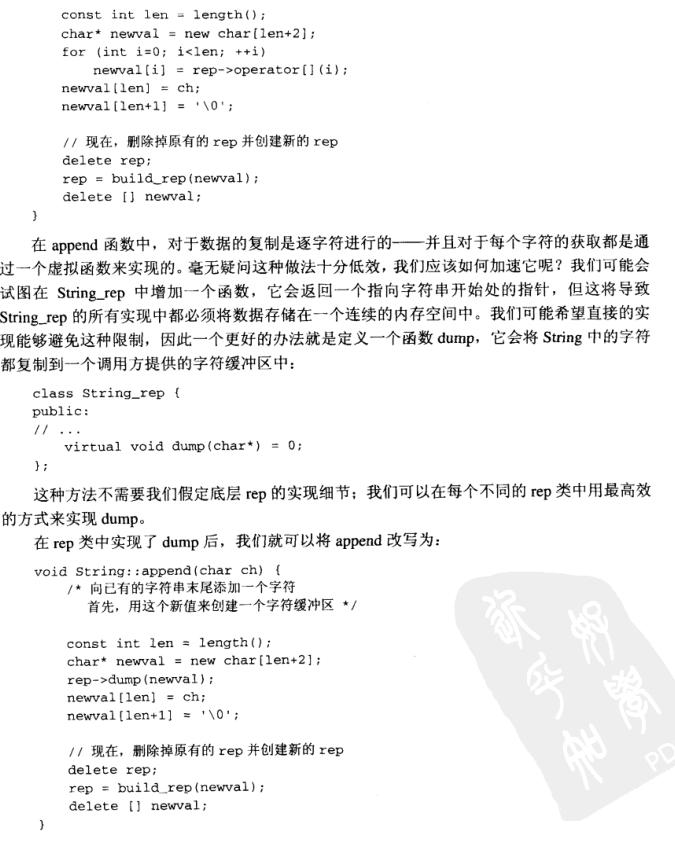
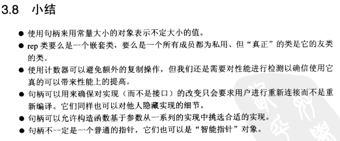
