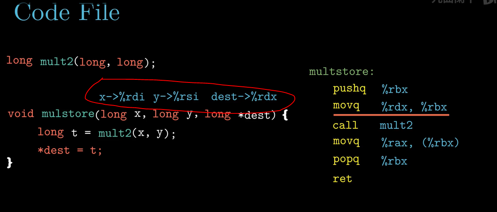
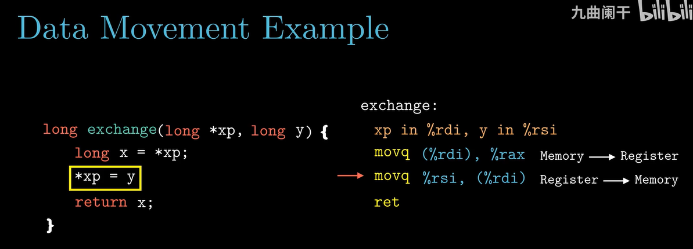
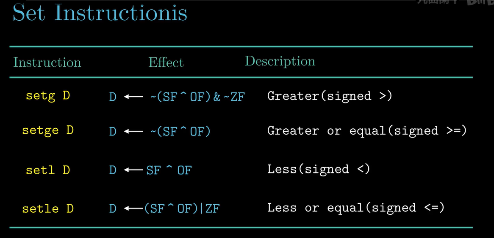

# <深入理解计算机系统> - B站课程 by 九曲阑干

## 3-1 程序的机器级表示
====

参数入栈从右到左一次保存在寄存器: %rdx, %rsi, %rdi
* 第1个参数: %rdi
* 第2个参数: %rsi
* 第3个参数: %rdx
* 第4个参数: %rcx
* 第5个参数: %r8
* 第6个参数: %r9

不同的寄存器有不同的保存策略：
* Calleed saved： %rbx, %rbp, %12, %13, %14, %15
* Caller saved:
  * %10, %11
  * %rax
  * %rdi, %rsi, %rdx, %rcx, %r8, %r9

## 3-2 寄存器与数据传送指令

上图最后一条指令：64位寄存器的规定，即任何位寄存器生成32位值的指令都会把该寄存器的高位部分置为0

没有movzlq，是因为movl就是默认将高32位置零。

cltq指令与movslq相同，操作数总是%eax,%rax寄存器，进行符号位扩展

## 3-3 栈与数据传送指令

## 3-4 算术逻辑指令

> 注意算术运算的第一个操作数是`D`，目的操作数

## 3-5 指令与条件码

> CF: 无符号数相加，产生进位
> OF: 有符号数相加，产生正溢出或负溢出

## 3-6 跳转指令与循环

> 这段代码的实现运行效率会比上面的高，关键在于`cmovge`指令
> cmovge %rdx, %rax =>>> ~(SF ^ OF)
> 基于条件码的组合来进行有条件的数据传送

## 3-7 过程(函数调用)

> first 6 arguments are passed in through registers
> %r8w => word long for %r8
> the last 2 arguments are passed through stack
> the arguments through stack are aligned to 8 bytes (64bits)

> leaq 8(%rsp), %rsi => 将arg2的地址作为第二个参数放到%rsi
> movq %rsp, %rdi => 将arg1的地址作为第一个参数放到%rdi

> 函数调用传参时需要对齐到8个字节，但是局部变量不需要

## 3-9 结构与联合体

