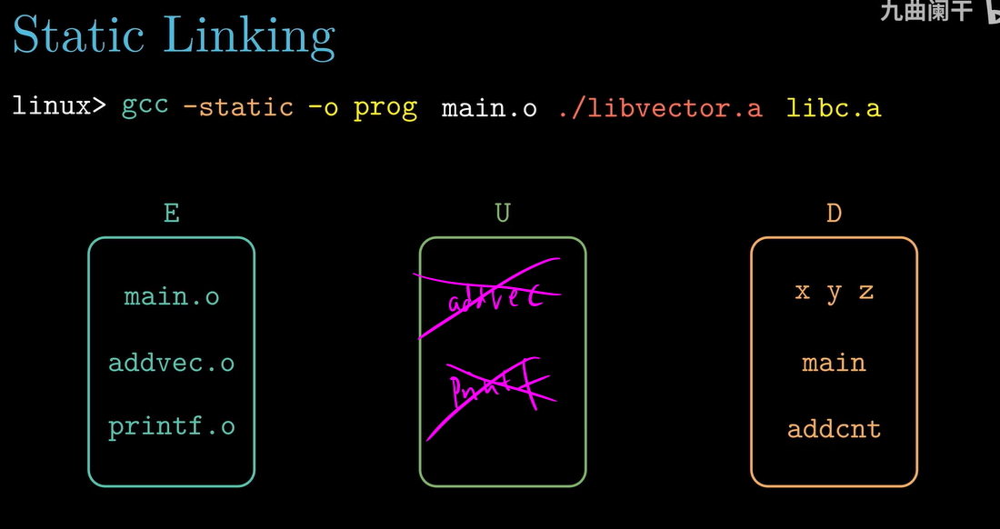

# <深入理解计算机系统> - B站课程 by 九曲阑干

## 7-2 可重定位目标文件
====

`wc`命令可以查看文件的字节大小 （1064 + 13 * 64）

## 7-3 符号和符号表
====

`value`未初始化的全局变量，存放在了COMMON节中。
COMMON： 未初始化的全局变量
.bss： 未初始化的静态变量，初始化为0的全局或静态变量

## 7-4 符号解析与静态库
====
strong symbol（强符号）：函数和已初始化的全局变量
weak symbol（弱符号）：未初始化的全局变量

Rule 1：（多个强符号同时出现）
函数定义，初始化的全局变量

Rule 2：
一个强符号与多个弱符号同时出现

将会输出15212，数据更改了。
一个强符号与不同类型的弱符号同时出现：

Rule 3：
多个弱符号同时出现

-fno-common编译选项，当遇到多重定义时，编译器报错。

最后合并E中文件，生成可执行文件
在使用静态链接时，文件输入顺序很重要。

## 7-6 重定位
====
relocation：
* relocating sections and symbol definitions
* relocating symbol references within sections
节.rel.text和节.rel.data

## 7-7 可执行目标文件

数据段加载到内存，需要多出8个字节，是因为需要用来存储.BSS section定义的数据

