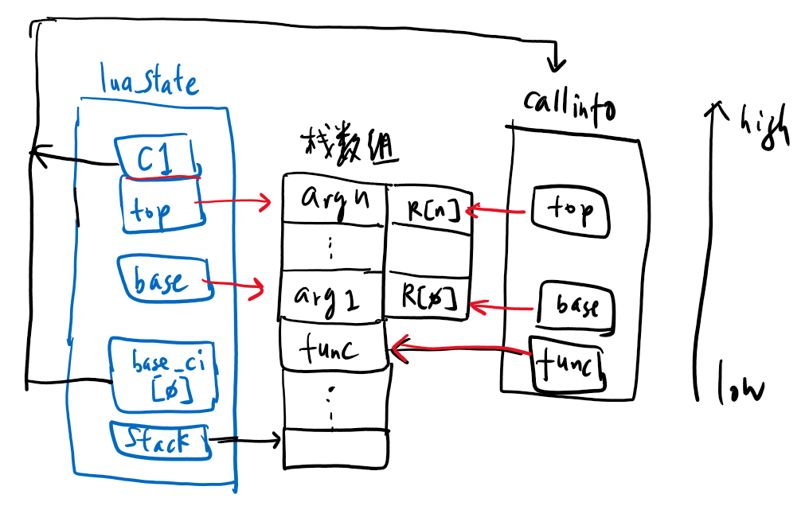
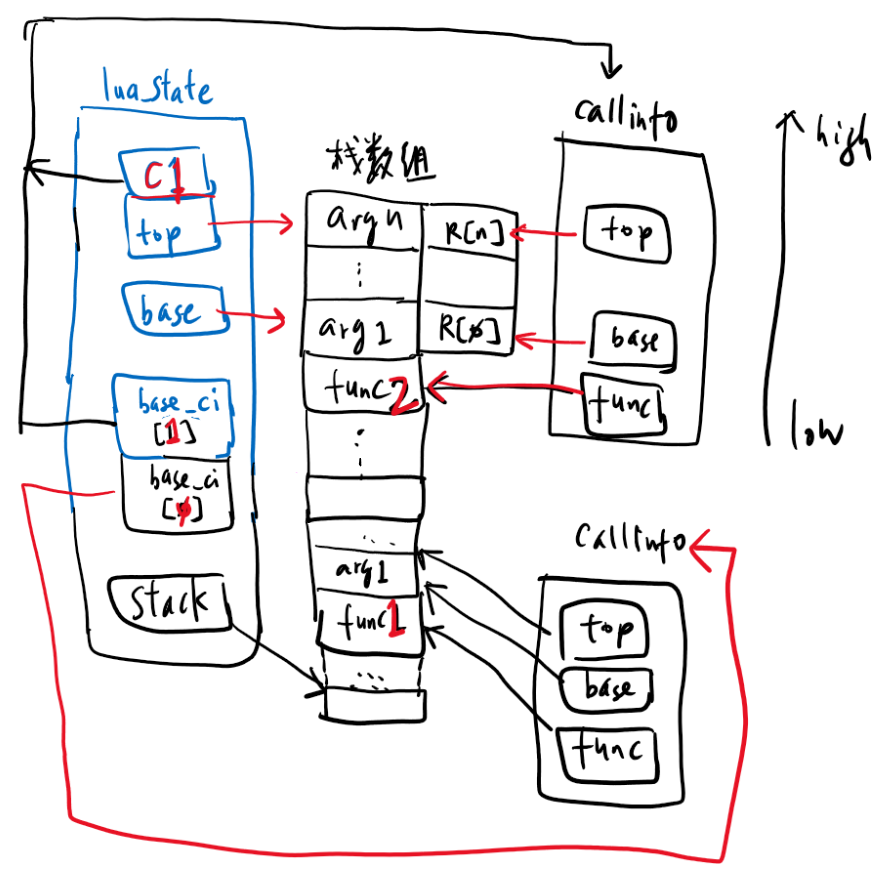

# 书<Lua设计与实现>阅读笔记

## 第5章-Lua虚拟机

Lua执行过程概述
====
一个语言的解释器需要完成以下工作：
* 将源代码编译成虚拟机可以识别执行的字节码；
* 为函数调用准备调用栈；
* 内部维持一个IP（指令指针）来保存下一个将执行的指令地址，也即是PC；
* 模拟一个CPU的运行，循环拿出由IP指向的字节码，根据字节码格式进行节码，然后执行字节码；

虚拟机由两种不同的实现方式：基于栈的虚拟机和基于寄存器的虚拟机（stack-based 和register-based）。
Java/C#是基于栈的虚拟机，Lua是第一个使用基于寄存器虚拟机；
基于栈的虚拟机，在指令之前需要准备号数据，将数据压栈，这是缺点。优点就是指令中不需要关心操作数的地址，在执行之前已经将操作数准备在栈顶上了。
==> 指令知道到哪里去获取操作数，而且获取多少个操作数。
==> 指令长度就可以固定，一般为1个字节长度，可以cover到256种指令格式。
基于寄存器的虚拟机，不需要PUSH/POP指令，在字节码中带上具体的操作数所在的寄存器地址，或者操作数所在的位置信息（一般是一个具体已知位置的索引）。

> Python的字节码长度定义为一个字节，但是有些字节码指令需要参数，有些不需要，从代码层面上就定义好了。
> 当指令序列（字节数组）送入虚拟机时，根据解析出的字节码来简单判断指令是否需要操作数，如果需要，字节码后面紧跟着的2个字节就是操作数，虚拟机会将它们读取处理，然后执行指令。如果不需要操作数，则执行这个指令。

> Java的字节码比较中规中矩，一个字节表示字节码，从操作数栈上获取对应的操作数。每条指令知道获取几个操作数。符合典型的基于栈的虚拟机执行方式。

> Lua的字节码（32bits）中含有操作码，和操作数索引地址，俗称寄存器索引。操作数仍然从一个已知的地方进行索引，可以是函数中的常量表，可以是操作数栈。不是真正的CPU寄存器，而是一个虚拟的寄存器，或称为操作数索引。

Lua使用的是基于寄存器的虚拟机实现方式，很大原因是它的设计目标之一就是尽可能高效。
- 设计一套字节码，分析源代码文件生成字节码；
- 在虚拟机中执行字节码；
- 如何在整个执行过程中保存整个执行环境；

```c++
#define luaL_dofile(L, fn) \
    (luaL_loadfile(L, fn) || lua_pcall(L, 0, LUA_MULTRET, 0))
```
- `luaL_loadfile`进行源码编译，然后输出字节码信息：`Proto`，放入虚拟栈中；
- `lua_pcall`进行虚拟机执行；

`Proto`结构体中包含了以下内容：
- 函数的常量数组；
- 编译生成的字节码信息；
- 函数的局部变量信息；
- 保存upvalue名字的数组；

每个Lua虚拟机对应一个lua_State结构体，它使用TValue数组来模拟栈：
- stack： 栈数组的起始位置；
- base：当前函数栈的基地址；
- top：当前栈的下一个可用位置；

数据结构与栈
====
然而lua_State里保存的是一个Lua虚拟机的全局状态，当执行到一个函数时，需要由对应的数据结构来表示函数相关的信息。这个数据结构就是`CallInfo`，这个结构体同样由`top`, `base`这两个与栈相关的成员；
在`lua_State`中，有一个base_ci的CallInfo数组，存储的时CallInfo的信息。而另一个成员，指向的就是当前函数的CallInfo指针。
在调用函数之前，一般需要调用luaD_precall函数，完成以下几个操作：
- 保存当前虚拟机执行的指令savedpc到当前CallInfo的savedpc中。此处保存下来的为了后买你调用完成之后恢复执行。
  - 类似于C调用指令call时，会自动把当前指令下一个指令地址保存到栈上，一般调用完之后恢复执行；
- 分别计算出待调用函数的base, top值，这些值的计算依赖于函数的参数数量；
- 从lua_State的base_ci数组中分配一个新的CallInfo指针，存储前面两步计算出来的信息，切换到这个函数中准备调用；

lua_State结构体中top，base指针是与函数执行相关的变量，在函数执行前后都会有变化；永远指向当前执行的函数的栈；



