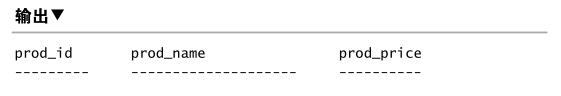
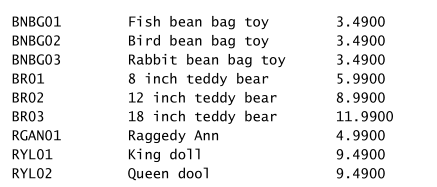

# 书<SQL必知必会>阅读笔记

第2章：检索数据
===

## SELECT语句
sql语句是由简单的英语单词组成的，由一个或多个关键字（keyword）构成的。
从一个或多个表中检索信息。
要使用SELECT语句，至少必须给出2条信息---想选择什么，以及从什么地方选择。

```sql
SELECT prod_name
FROM Products;
```
- 语句从`Products`表中检索一个名为`prod_name`的列；
- 这条语句的执行结果是输出对应列对应的所有的行，其它列不输出；
- 结束语句用`;`（最好加上);

多个列检索：
```sql
SELECT prod_id, prod_name, prod_price
FROM Products;
```


- 多个列之间用逗号分隔；
- SQL语句一般返回原始的、无格式的数据；

检索所有列：
```sql
SELECT *
FROM Products；
```
- 通配符(`*`)，检索所有列；
- 列的顺序一般是列在表定义中出现的物理顺序，但并不总是如此；

检索不同的值：
```sql
SELECT vend_id
FROM Products；
```
- 返回的行中，会有重复的行值出现；
- 采用`DISTINCT`关键字对结果进行过滤，关键字放在列名的前面；
```sql
SELECT DISTINCT vend_id
FROM Products；
```
> DISTINCT关键字作用于所有的行，不仅仅是跟在其后的那一列。

限制结果：
```sql
SELECT prod_name
FROM Products
LIMIT 5;
```
- 不同的数据库系统，实现语法不太一样；上面示例是MySQL/SQLite/PostgreSQL支持；
- `LIMIT 5`指示返回不超过5行的数据；
```sql
SELECT prod_name
FROM Products
LIMIT 5 OFFSET 5;
```
> 从第5行起的5行数据。

注释:
- 单行注释
```sql
SELECT prod_name  -- 这是一条注释
FROM Products
```
- 类似于shell/python的注释
```sql
# 这是一条注释(很少得到支持)
SELECT prod_name
FROM Products
```
- 类似于C/C++语言的多行注释
```sql
/*
SELECT prod_name
FROM Products*/
SELECT prod_name
FROM Products
```
