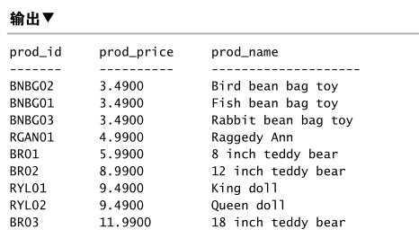

# 书<SQL必知必会>阅读笔记

第3章：排序检索数据
===

## 排序数据
```sql
SELECT prod_name
FROM Products
ORDER BY prod_name；
```
- 语句从`Products`表中检索一个名为`prod_name`的列；
- 这条语句的执行结果是输出对应列对应的所有的行，其它列不输出；
- 输出结果采用`prod_name`进行排序；

多个列检索排序：
```sql
SELECT prod_id, prod_name, prod_price
FROM Products;
ORDER BY prod_price, prod_name;
```


按照位置排序：
```sql
SELECT prod_id, prod_name, prod_price
FROM Products;
ORDER BY 2, 3;  # <prod_name>, <prod_price>
```
输出结果跟上面的一样


指定排序方向：
```sql
SELECT prod_id, prod_name, prod_price
FROM Products;
ORDER BY prod_price DESC；# ASC 是默认的
```
