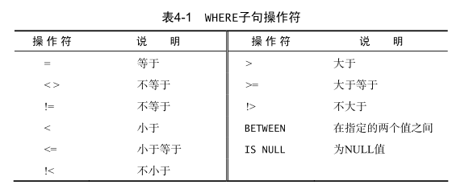

# 书<SQL必知必会>阅读笔记

第4章：过滤数据
===

## 过滤数据
```sql
SELECT prod_name
FROM Products
WHERE prod_price = 3.49;
```
- 语句从`Products`表中检索一个名为`prod_name`的列；
- 这条语句的执行结果是输出对应列对应的所有的行，其它列不输出；
- 只输出prod_price=3.49的那些行

当`ORDER BY`和`WHERE`一起使用时，`ORDER BY`应该将`ORDER BY`放在`WHERE`的后边。表示是对过滤后的结果进行排序，否认则会报错。
可采用的子句操作符：


空值检查：
```sql
SELECT prod_name
FROM Products
WHERE prod_price IS NULL;
```
