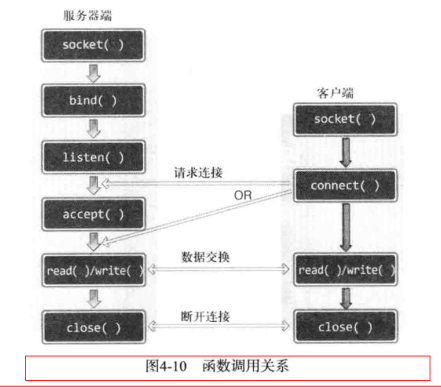

# 第4章: 基于TCP的服务端/客户端

TCP： Transmission Control Protocol (传输控制协议)的简写，意为“对数据传输过程的控制”。

```c++
#include <sys/socket.h>
int connect(int sock, struct sockaddr* servaddr, socklen_t addrlen);
```
=> success: 0, fail: -1
客户端调用connect函数后，发生以下情况之一才会返回（完成函数调用）：
1. 服务器端接收连接请求；
2. 发生断网等异常情况而中断连接请求；
=> 所谓的“接收连接”并不意味着服务器端调用accept函数，其实是服务器端把连接请求信息记录到等待队列。因此connect函数返回后并不立即进行数据交换。

客户端套接字地址信息？
实现服务器端必经过程之一就是给套接字分配IP和端口号。但客户端实现过程中并未出现套接字地址分配，而是创建套接字后立即调用connect函数。
- 何时？调用connect函数时；
- 何地？操作系统、更准确地说是在内核中；
- 如何？IP用计算机的IP，端口随机；

## 基于TCP的服务器端/客户端函数调用关系

服务器端创建套接字后连续调用bind、listen函数进入等待状态，客户端通过调用connect函数发起连接请求。需要注意的是，客户端只能等到服务器端调用listen函数才能调用connect函数。同时要注意，客户端调用connect函数前，服务器端有可能率先调用accept函数，进入阻塞状态，直到客户端connect函数为止。

TCP内部工作原理1： 与对方套接字的连接，共3步：
1. 与对方套接字建立连接;
2. 与对方套接字进行数据交换；
3. 断开与对方套接字的连接；

全双工(full-duplex)方式工作的。可以双向传递数据。
[SYN] SEQ: 1000, ACK: -
- 现传递的数据包序号为1000，如果接收无误，请通知我向您传递1001号的数据包；
[SYN+ACK]SEQ: 2000, ACK: 1001
- 此时SEQ为2000，ACK为1001，而SEQ为2000的含义如下：
- 现传递的数据包序号为2000，如果接收无误，请通知我向您传递2001号数据包；
- 而ACK 1001的含义如下：
- 刚才传输的SEQ为1000的数据包接收无误，现在请传递SEQ为1001的数据包；
[ACK] SEQ: 1001, ACK: 2001
- 已正确收到传输的SEQ为2000的数据包，现在可以传输SEQ为2001的数据包；
