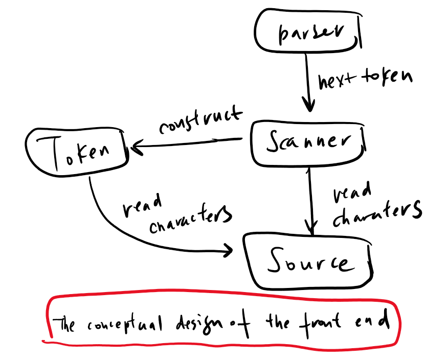
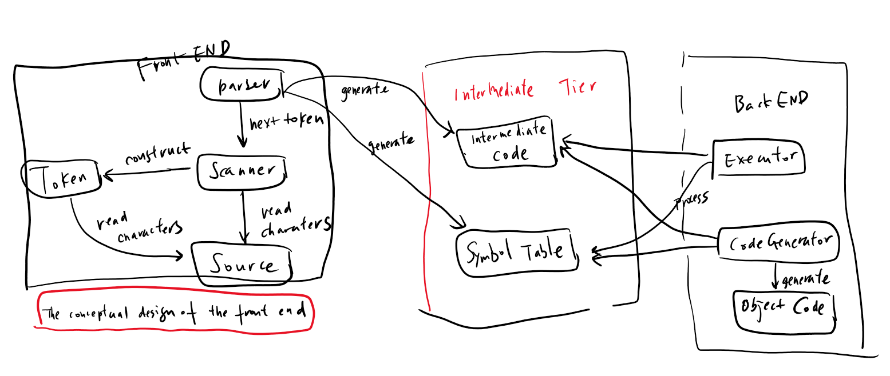

# 书<Writing Compilers and Interpreters - A software Engineering Approach>阅读笔记

第1章: Introduction
===

## Goals and Approach
This book teaches the basics of writing compilers and interpreters. Its goals are to show you how to design and develop:
* A compiler written in Java for a major subset of Pascal,  a high-level procedure-oriented programming language. The compiler will generate code for the Java Virtual Machine (JVM)
* An interpreter written in Java for the same Pascal subset that will include an interactively symbolic debugger.
* An intergrated development environment (IDE) with a graphical user interface. It will include a source program editor and an interactive interface to set breakpoints, do single stepping, view and se variables values, and more.

## What are compilers and interpreters?
The main purpose of a compiler or an interpreter is to translate a soruce pgoram writte in a high-level source language.In this book, the source language will be a large subset of Pascal. In other words, you wil compile and interpret Pascal programs. The implementing language is Java.
So how is an interpreter different from a compiler?
An interpreter does not generate an object program. Instead, after reading in a source program, it executes the program.

The best of both worlds include an interpreter with an interactive symbolic debugger to use during program development and a compiler to generate machine language code for fast execution after you've debugged the program. Such are the goals of this book, since it teaches how to write both compilers and interpreters.

Let's agree for this book that if a translater translates a source program into machine language, whether for an actual computer or for a virtual machine, the translater is a **compiler**. A translater that executes the source program without first generating machine language is an **interpreter*.

## Conceptual Design
The conceptual design of a program is a high-level view of its software architecutre. The conceptual design includes the primary components of the program, how they're organized, and how they interact with each other. It doesn't necessarily say how these components will be implemented.
The front end of a translater reads the source program and performs the initial translation stage. Its primary components are the parser, the scanner, the token, and the source.
The parser controls the translation process in the front end. It repeatedly asks the scanner for the next token, and it analyzes the sequences of tokens to determine what high-level language elements it is translating, such arithmetic expression, assignment statements, or procedure declarations. The parser verifies that what it sees is syntactically correct as written in the source program; in other words, the parser detects and flags any syntax errors. What the parser does is called parsing, and the parser parses the source program to translate it.
The scanner reads the characters of the source program sequentially and constructs tokens, which are the low-level elements of the source language. What the scanner does is called scanning, and the scanner scans the source program to break it apart into tokens.

A compiler ultimately translates a source program into machine language object code, so the primary component of its back end is a **code generator**. An interpreter executes the program, so that primary component of its back end is **an executor**.

interpter and compile share the same frontend, their different back ends need a common intermediate interface with the front end. The front end generates intermediate code and a symbol table in the intermediate tier that serve as the common interface.

A compiler's back end processes the intermediate code and the symbol table to generate the machine language version of the source program. An interpreter's back end processes the intermedidate code and the symbol table to execute the program.

Syntactic actions occur only in the front end. **Semantic actions occur in the front and back ends**. Executing a program in the back end or generating object code for it requires knowing the meaning of its statements and so they consist of semantic actions.

Lexical analysis is the formal term for scanning, and thus a scanner can be called a lexical analyzer. Syntax analysis is the formal term for parsing, and a syntax analyzer is the parser. Semantics analysis involves checking that semantic rules aren't broken.
