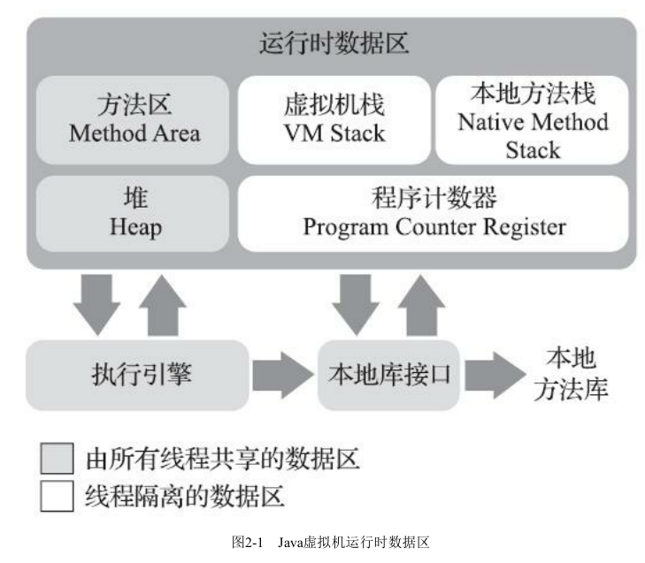

# 书<深入理解JAVA虚拟机 - JVM高级特性于最佳实践> 第3版 - by 周志明

## 第2章： Java内存区域于内存溢出异常

* 程序计数器
====
程序计数器是一块较小的内存空间，它可以看作是当前线程所执行的字节码的行号指示器，在Java虚拟机的概念模型里，字节码解释器工作时就是通过改变这个计数器的值来选取下一条需要执行的字节码指令，它是程序控制流的指示器，分支、循环、跳转、异常处理、线程恢复等基础功能都需要依赖这个计数器来完成。

* Java虚拟机栈
====
每一个方法被调用直至执行完毕的过程，就对应着一个栈帧在虚拟机中从入栈到出栈的过程。
局部变量表存放了编译器可知的各种Java虚拟机基本数据类型，对象引用和returnAddress类型。
局部变量表所需要的内存空间在编译期间完成分配，当进入一个方法时，这个方法需要在栈帧中分配多大的局部变量空间是完全确定的，在方法运行期间不会改变局部变量表的大小。（这点跟C/C++的栈帧中局部变量空间分配有点类似）。
对这个内存区域规定了两类异常状况：如果线程请求的栈深度大于虚拟机所允许的深度，将抛出StackOverflowError异常；如果Java虚拟机栈容量可以动态扩展，当栈扩展时无法申请到足够的内存会抛出OutOfMemoryError异常。

* 本地方法栈
====

* Java堆
====
如果从分配内存的角度看，所有线程共享的Java堆中可以划分出多个线程私有的分配缓冲区(Thread Local Allocation Buffer, TLAB)，以提升对象分配时的效率。不过无论从什么角度，无论如何划分，都不会改变Java堆中存储内容的共性，无论时哪个区域，存储的都只能是对象的实例，将Java堆细分的目的只是为了更好的回收内存，或者更快的分配内存。

* 方法区
====
方法区与Java堆一样，是各个线程共享的内存区域，它用于存储已被虚拟机加载的类型信息、常量、静态变量、即时编译器编译后的代码缓存等数据。

* 运行时常量池
====
运行时常量池(Runtime constant pool)是方法区的一部分。Class文件中除了有类的版本、字段、方法、接口等描述信息之外，还有一项信息是常量池表，用于存放编译期生成的各种字面量与符号引用，这部分内容将在类加载后存放到方法区的运行时常量池中。
运行时常量池相对于Class文件常量池的另外一个重要特征是具备动态性，Java语言并不要求常量
一定只有编译期才能产生，也就是说，并非预置入Class文件中常量池的内容才能进入方法区运行时常
量池，运行期间也可以将新的常量放入池中，这种特性被开发人员利用得比较多的便是String类的
intern()方法。
既然运行时常量池时方法区的一部分，自然受到方法区内存的限制，当常量池无法再申请到内存时会抛出OutOfMemoryError异常。

* 直接内存
====
直接内存并不是虚拟机运行时数据区的一部分。
在JDK1.4中新加入了NIO(new Input/Output)类，引入了一种基于通道与缓冲区的I/O方式，它可以使用Native函数库直接分配堆外内存，然后通过一个存储在Java堆里面的DirectByteBuffer对象作为这块内存的引用进行操作。这样能在一些场景中显著提高性能，因此避免了在Java堆和native堆中来回复制数据。

### HotSpot虚拟机对象探秘
====
* 对象的创建
=====
当Java虚拟机遇到以条字节码new指令时，首先将会检查这个指令的参数是否能在**常量池**中定位到一个类的符号引用，并且检查这个符号引用代表的类是否已被加载、解析和初始化过。如果没有，那必须执行相应的类加载过程。

* 对象的访问定位
=====
主流的访问方式主要有使用句柄和直接指针两种：
- 如果使用句柄访问的话，Java队中将可能会划分出一块内存作为句柄池，reference中存储的就是对象的句柄地址，而句柄中包含了对象实例数据与类型数据各自具体的地址信息。
它最大的好处就是reference中存储的是稳定句柄地址，在对象被移动时只会改变句柄中实例数据指针，而reference本身不需要被修改。

- 如果使用直接指针访问的话，Java堆中对象的内存布局就必须考虑如何防止访问类型数据的相关信息，reference中存储的直接就是对象地址，如果只是访问对象本身的话，就不需要多一次间接访问的开销。
它最大的好处就是速度更快，它节省了一次指针定位的时间开销。Hotspot主要采用第二种方式进行对象访问。

