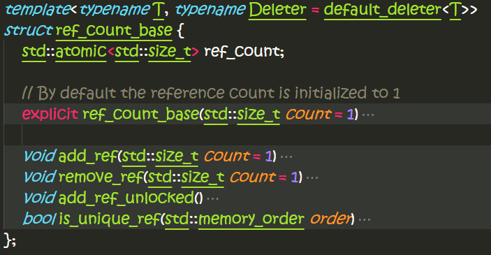
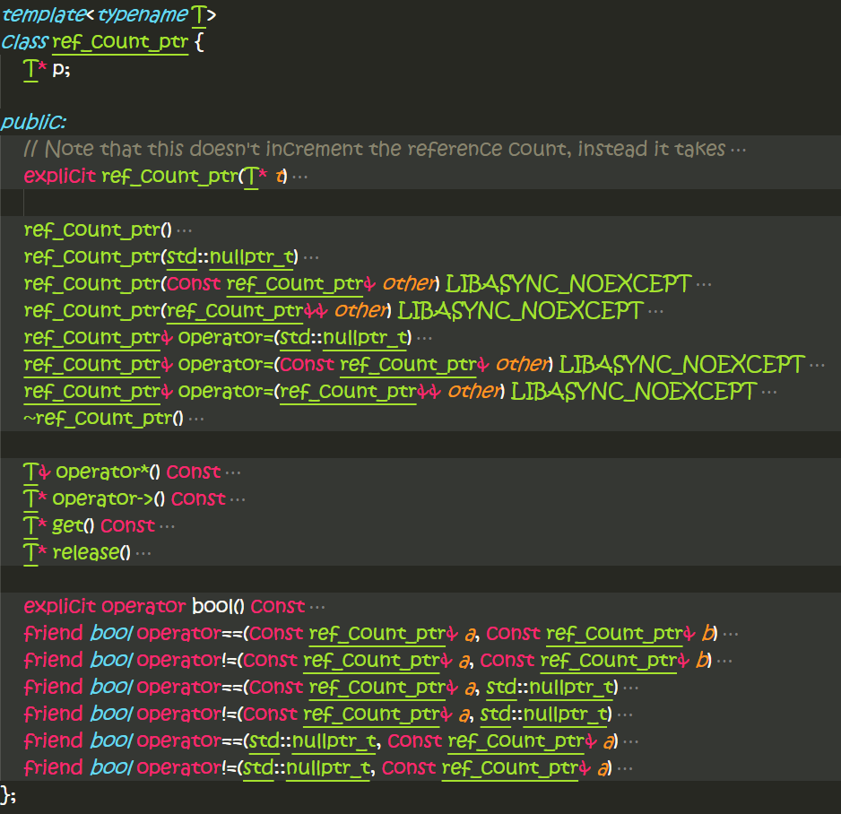

# ref_count学习

文件
=====
- include\async++\ref_count.h

ref_count_base类接口
=====

这个函数模板基于std::atomic来实现原子性的增加和减少引用计数

ref_count_ptr类接口
======

// Pointer to reference counted object, based on boost::intrusive_ptr
基于boost::intrusive_ptr来实现的引用技术机制的智能指针。
- 这个类模板要求参数类型T满足一些引用计数操作接口，最好是继承于上面的ref_count_base基类；
- 提供了copy ctor，基于引用计数；
- 提供了move ctor，直接move操作；
- 提供了copy assignment，基于引用计数；
- 提供了move assignment，直接move操作；
- 提供直接从nullptr进行构造和重新赋值，这种语义满足原始指针的语义；
- 提供了`release`接口释放managed指针；这个不同于std::shared_ptr，它并没有提供release类接口
- 提供比较操作符，同时也跟nullptr进行比较，模拟原始指针的操作

copy assignment存在自我赋值时的bug：
```CPP {.numberLines}
ref_count_ptr& operator=(const ref_count_ptr& other) LIBASYNC_NOEXCEPT
{
    if (p) {
        p->remove_ref();
        p = nullptr;
    }
    p = other.p;
    if (p)
        p->add_ref();
    return *this;
}
```
应该先`other.p->add_ref()`，后`p->remove_ref();`。

注意的是一个指针参数的构造函数，并不increase refcount：
```CPP {.numberLines}
// Note that this doesn't increment the reference count, instead it takes
// ownership of a pointer which you already own a reference to.
explicit ref_count_ptr(T* t)
    : p(t) {}
```
因为suppose输入指针是引用计数型的指针，它的refcnt >= 1，没有任何其它的ref_count_ptr own它。

```CPP {.numberLines}
	T* release()
	{
		T* out = p;
		p = nullptr;
		return out;
	}
```
`release`函数为啥不decrement refcount ??
=> 原因在于`release`只是转移指针给调用者，不是拷贝，故没有更多的或更少的T*指向原始对象
