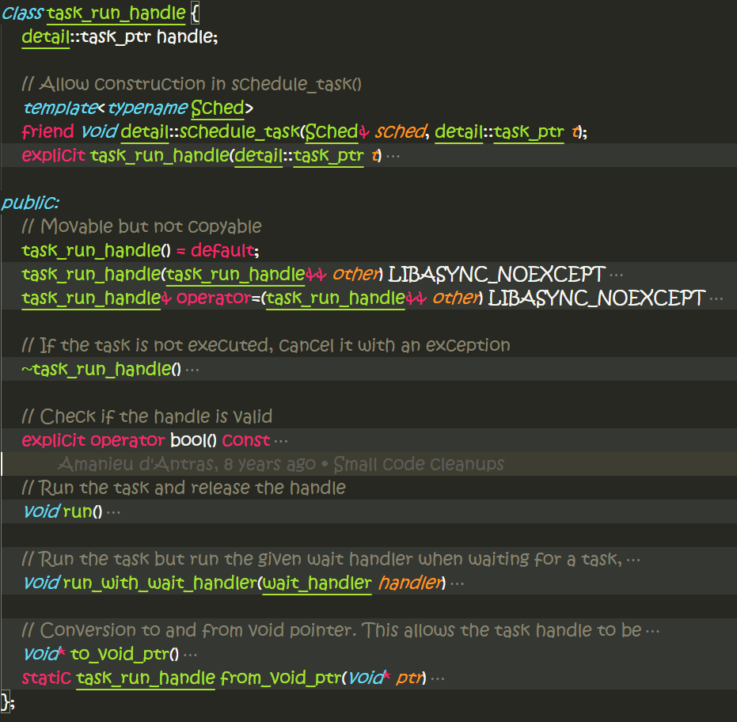
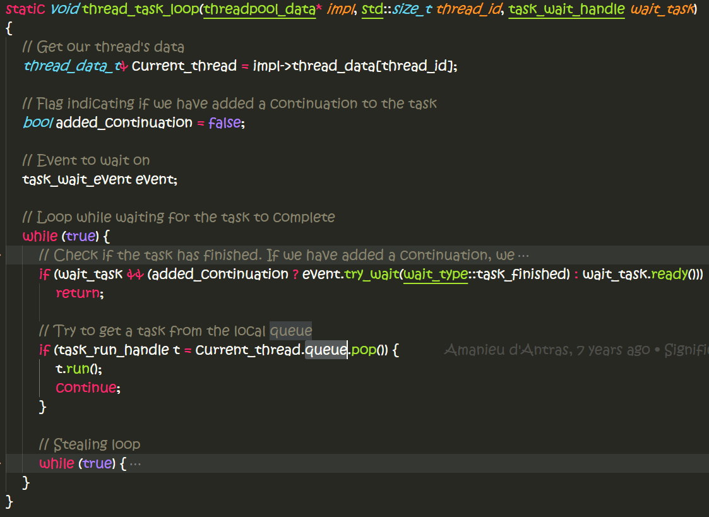

# 学习scheduler的代码

scheduler是如何schedule task运行的？
=======
```CPP {.numberLines}
detail::schedule_task(sched, detail::task_ptr(detail::get_internal_task(out)));

// Schedule a task for execution using its scheduler
template<typename Sched>
void schedule_task(Sched& sched, task_ptr t)
{
    static_assert(is_scheduler<Sched>::value, "Type is not a valid scheduler");
    sched.schedule(task_run_handle(std::move(t)));
}
```
> `task_ptr`对象被move/wrap到另一个对象中`task_run_handle`
> // Task handle used in scheduler, acts as a unique_ptr to a task object
它的接口如下：


task_run_handle析构的时候，直接就将task cancel掉了，而不是等待它完成，而且采用的是抛异常的方式：
```CPP {.numberLines}
// If the task is not executed, cancel it with an exception
~task_run_handle()
{
    if (handle)
        handle->vtable->cancel(handle.get(), std::make_exception_ptr(task_not_executed()));
}
```
？？析构函数可以抛异常？？？？？==**TODO： 研究下**==

这里是最终被scheduler调用起来的地方：
```CPP {.numberLines}
// Run the task and release the handle
void run()
{
    handle->vtable->run(handle.get());
    handle = nullptr;
}
```
- handle就是task_ptr，它其实是一个task_func，也是一个task_base
- handle->vtable->run调用的就是下面的函数：
    ```CPP {.numberLines}
    // Run the stored function
    static void run(task_base* t) LIBASYNC_NOEXCEPT
    {
        LIBASYNC_TRY {
            // Dispatch to execution function
            static_cast<task_func<Sched, Func, Result>*>(t)->get_func()(t);
        } LIBASYNC_CATCH(...) {
            cancel(t, std::current_exception());
        }
    }
    ```

运行时还可以添加wait_handler:
```CPP {.numberLines}
// Run the task but run the given wait handler when waiting for a task,
// instead of just sleeping.
void run_with_wait_handler(wait_handler handler)
{
    wait_handler old = set_thread_wait_handler(handler);
    run();
    set_thread_wait_handler(old);
}
```
> 这是如何工作的呢？==**TODO: 学习下**==

从task_ptr构造一个task_run_handle的构造函数时私有的，但对schedule_task友元了：
```CPP {.numberLines}
// Allow construction in schedule_task()
template<typename Sched>
friend void detail::schedule_task(Sched& sched, detail::task_ptr t);
explicit task_run_handle(detail::task_ptr t)
    : handle(std::move(t)) {}
```

所以task_run_handle在scheduler和task之间增加了一层间接层

对于`line_scheduler_impl`来说，它就在当前submit线程中直接运行task:
```CPP {.numberLines}
// Inline scheduler implementation
inline void inline_scheduler_impl::schedule(task_run_handle t)
{
	t.run();
}
class inline_scheduler_impl {
public:
	static void schedule(task_run_handle t);
};

```

scheduler定义了很多不同策略的scheduler:
- `inline_scheduler_impl`： 在task提交线程种立即运行task，同步；
    ```CPP {.numberLines}
    // Run a task in the current thread as soon as it is scheduled
    // 全局singleton的inline scheduler对象
    inline detail::inline_scheduler_impl& inline_scheduler()
    {
    	static detail::inline_scheduler_impl instance;
    	return instance;
    }
    ```
- `thread_scheduler_impl`:  在另外一个线程中运行task，异步；
    ```CPP {.numberLines}
    // Run a task in a separate thread. Note that this scheduler does not wait for
    // threads to finish at process exit. You must ensure that all threads finish
    // before ending the process.
    inline detail::thread_scheduler_impl& thread_scheduler()
    {
    	static detail::thread_scheduler_impl instance;
    	return instance;
    }
    ```
- `threadpool_scheduler`：将task丢到线程池中运行，异步；
    ```CPP {.numberLines}
    // Built-in thread pool scheduler with a size that is configurable from the
    // LIBASYNC_NUM_THREADS environment variable. If that variable does not exist
    // then the number of CPUs in the system is used instead.
    LIBASYNC_EXPORT threadpool_scheduler& default_threadpool_scheduler();
    ```
    ```CPP {.numberLines}
    // Default scheduler that is used when one isn't specified. This defaults to
    // default_threadpool_scheduler(), but can be overriden by defining
    // LIBASYNC_CUSTOM_DEFAULT_SCHEDULER before including async++.h. Keep in mind
    // that in that case async::default_scheduler should be declared before
    // including async++.h.
    #ifndef LIBASYNC_CUSTOM_DEFAULT_SCHEDULER
    inline threadpool_scheduler& default_scheduler()
    {
    	return default_threadpool_scheduler();
    }
    #endif
    ```
    > 库默认的scheduler就是thread pool scheduler，但是可以通过编译选项进行配置。编写你自己的default_scheduler()函数。


thread_scheduler类的实现
======
```CPP {.numberLines}
// Thread scheduler implementation
void thread_scheduler_impl::schedule(task_run_handle t)
{
    // A shared_ptr is used here because not all implementations of
    // std::thread support move-only objects.
    std::thread([](const std::shared_ptr<task_run_handle>& t) {
        t->run();
    }, std::make_shared<task_run_handle>(std::move(t))).detach();
}
```
- 它是直接启动一个线程`std::thread`运行task，而且立马detach掉，不进行同步。
- 这里采用std::shared_ptr来实现lambda绑定movable-only的对象

```CPP {.numberLines}
threadpool_scheduler& default_threadpool_scheduler()
{
	return detail::singleton<detail::default_scheduler_impl>::get_instance();
}
```
`threadpool_scheduler`是接口类，`default_scheduler_impl`是实现类。接口类只定义了一个函数：`schedule(task_run_handle)`;
`default_scheduler_impl`类做的事情很简单，就是提供默认thread#的一个版本，线程池个数要么从环境变量中获取，要么直接用系统默认的`std::thread::hardware_concurrency()`。

其实`threadpool_scheduler`类只是一个包装类，包装的是`std::unique_ptr<detail::threadpool_data> impl`。

`threadpool_scheduler`构造函数：
```CPP {.numberLines}
threadpool_scheduler::threadpool_scheduler(std::size_t num_threads)
	: impl(new detail::threadpool_data(num_threads))
{
	// Start worker threads
	impl->thread_data[0].handle = std::thread(detail::recursive_spawn_worker_thread, impl.get(), 0, num_threads);
#ifdef BROKEN_JOIN_IN_DESTRUCTOR
	impl->thread_data[0].handle.detach();
#endif
}
```
- 构造一个pimpl对象数据：`threadpool_data`;
- 启动一个单独线程，运行线程函数`recursive_spawn_worker_thread`;
- 这里有一个特别处理，在析构函数里调用`std::thread::join`会出问题？ ==**TODO**==


如何schedule一个task到scheduler下层的thread pool中，下面是它的代码逻辑：
```CPP {.numberLines}
// Schedule a task on the thread pool
void threadpool_scheduler::schedule(task_run_handle t)
{
	detail::threadpool_data_wrapper wrapper = detail::get_threadpool_data_wrapper();

	// Check if we are in the thread pool
	if (wrapper.owning_threadpool == impl.get()) {
		// Push the task onto our task queue
		impl->thread_data[wrapper.thread_id].queue.push(std::move(t));

		// If there are no sleeping threads, just return. We check outside the
		// lock to avoid locking overhead in the fast path.
		if (impl->num_waiters.load(std::memory_order_relaxed) == 0)
			return;

		// Get a thread to wake up from the list
		std::lock_guard<std::mutex> locked(impl->lock);

		// Check again if there are waiters
		size_t num_waiters_val = impl->num_waiters.load(std::memory_order_relaxed);
		if (num_waiters_val == 0)
			return;

		// Pop a thread from the list and wake it up
		impl->waiters[num_waiters_val - 1]->signal(detail::wait_type::task_available);
		impl->num_waiters.store(num_waiters_val - 1, std::memory_order_relaxed);
	} else {
		std::lock_guard<std::mutex> locked(impl->lock);

		// Push task onto the public queue
		impl->public_queue.push(std::move(t));

		// Wake up a sleeping thread
		size_t num_waiters_val = impl->num_waiters.load(std::memory_order_relaxed);
		if (num_waiters_val == 0)
			return;
		impl->waiters[num_waiters_val - 1]->signal(detail::wait_type::task_available);
		impl->num_waiters.store(num_waiters_val - 1, std::memory_order_relaxed);
	}
}
```

- `threadpool_data_wrapper`维护者当前线程的local数据：1) 是否存在指向threadpool的指针，代表发起schedule请求的线程是外围线程还是线程池里的一个线程；2) 如果是线程池中的线程，那是哪一个线程，用一个index来记录；
- 所以这里有判断逻辑，如果当前线程是线程池的一个线程，那么就将task放到那个线程local的task queue中，如果不是，就将task放到全局的task queue中；
- 两条路径最后都需要唤醒一个sleeping线程，如果有线程sleeping的话，用atomic变量`num_waiters`来track；
- 没有sleeping线程的话，直接返回，等有空闲线程的话，task就会被取走执行；

如果启动工作线程
======
`impl->thread_data[0].handle = std::thread(detail::recursive_spawn_worker_thread, impl.get(), 0, num_threads);`
在`threadpool_scheduler`构造函数里面，会启动一个辅助线程来并行启动所有的工作线程：
```CPP {.numberLines}
// Recursive function to spawn all worker threads in parallel
static void recursive_spawn_worker_thread(threadpool_data* impl, std::size_t index, std::size_t threads)
{
	// If we are down to one thread, go to the worker main loop
	if (threads == 1)
		worker_thread(impl, index);
	else {
		// Split thread range into 2 sub-ranges
		std::size_t mid = index + threads / 2;

		// Spawn a thread for half of the range
		impl->thread_data[mid].handle = std::thread(recursive_spawn_worker_thread, impl, mid, threads - threads / 2);
#ifdef BROKEN_JOIN_IN_DESTRUCTOR
		impl->thread_data[mid].handle.detach();
#endif

		// Tail-recurse to handle our half of the range
		recursive_spawn_worker_thread(impl, index, threads / 2);
	}
}
```
- 如果工作线程个数为1，那么当前这个线程就是工作线程，直接运行`worker_thread`函数；
- 否则，这里挺有意思的，就是采用recursive的方式来启动线程；
  - 先启动中间那个线程，借用中间的线程来调用当前函数，从而启动后一半线程，recursively；
  - 再recursive调用当前函数，启动前一半线程；
  - 但是为啥要用这么不太好理解的方式去启动线程呢？因为从启动线程的顺序来看，是先后一半线程先启动，然后是前一般线程启动，启动的顺序也是一个接着一个啊；为啥不直接loop呢？
> ==虽然启动顺序是一个接着一个，其实也不是，因为下一个线程是前一个线程在它自己的线程里面启动的。当前线程只做一件事情，那就是启动一个线程，然后递归调用自己，之后再启动一个线程，让这个新的线程去负责启动一半，自己负责前一半；这样的确可以比顺序启动线程要快些，因为有些线程启动会在并行的线程里面被启动。==

工作线程的线程函数
====
```CPP {.numberLines}
// Worker thread main loop
static void worker_thread(threadpool_data* owning_threadpool, std::size_t thread_id)
{
	// store on the local thread data
	create_threadpool_data(owning_threadpool, thread_id);

	// Set the wait handler so threads from the pool do useful work while
	// waiting for another task to finish.
	set_thread_wait_handler(threadpool_wait_handler);

	// Seed the random number generator with our id. This gives each thread a
	// different steal order.
	owning_threadpool->thread_data[thread_id].rng.seed(static_cast<std::minstd_rand::result_type>(thread_id));

    // Prerun hook
    if (owning_threadpool->prerun) owning_threadpool->prerun();

	// Main loop, runs until the shutdown signal is recieved
	thread_task_loop(owning_threadpool, thread_id, task_wait_handle());

    // Postrun hook
    if (owning_threadpool->postrun) owning_threadpool->postrun();
}
```
流程逻辑比较直接：
- 设置线程local参数：threadpool指针本身，和线程index；
- 设置线程等待handler：这样在等待task过程中可以调用这个handler做些其它事情；wait handler其实是一个thread local数据；
- prerun hook；
- 调用`thread_task_loop`；
- postrun hook；

```CPP {.numberLines}
// Wait for a task to complete (for worker threads inside thread pool)
static void threadpool_wait_handler(task_wait_handle wait_task)
{
	threadpool_data_wrapper wrapper = get_threadpool_data_wrapper();
	thread_task_loop(wrapper.owning_threadpool, wrapper.thread_id, wait_task);
}
```
这个线程等待handler也会调用`thread_task_loop`函数处理task，与正常处理task的工作流程一样，只是处理的task不同。
> ==这个就很有巧妙了。当线程没有真正的task时，它可以被派分一些特别的task去做==

这个是thread task loop函数，一个循环loop，直到遇到特别条件，它才会退出返回。


这里就是真正运行task的地方：从当前线程队列中取出一个task，然后在当前线程中调用。
```CPP {.numberLines}
// Try to get a task from the local queue
if (task_run_handle t = current_thread.queue.pop()) {
    t.run();
    continue;
}
```
不过这是从local queue中，从前面的代码阅读来看，只有从thread pool中的线程本身发出来的task，才会进入local queue中，大部分task都是放入了public queue。
