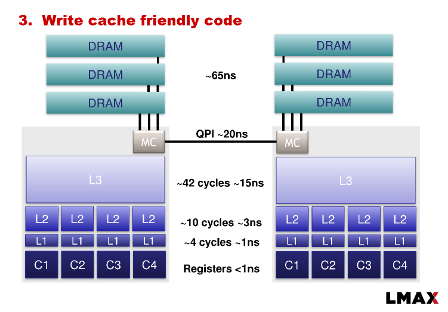
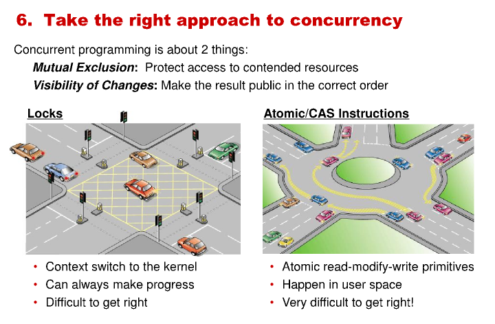
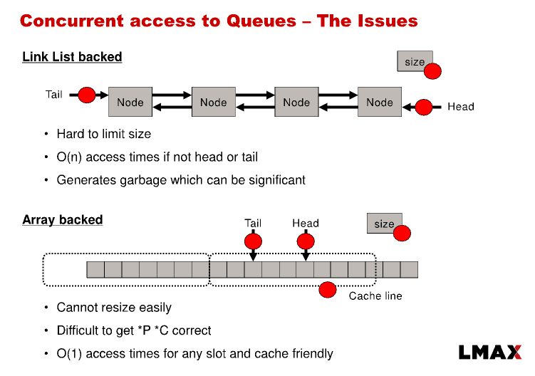
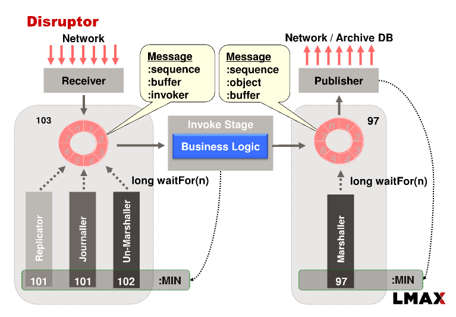
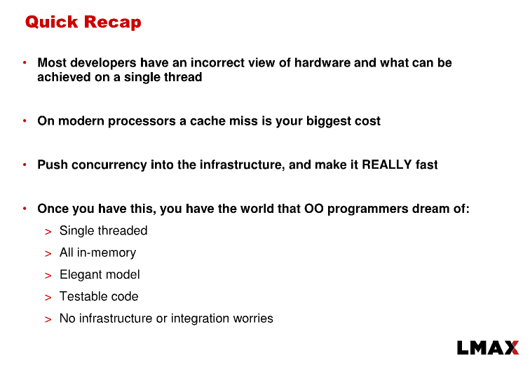

# reference:
https://www.infoq.com/presentations/LMAX/












# disruptor核心思想
* 二阶段提交+cas操作替代重量级的锁
* 预创建对象,避免频繁的gc (采用Array, 局部性原理)
* 缓存填充,避免缓存失效
* 位运算替代取模运算

在定义Object数组entries时：

this.entries = new Object[sequencer.getBufferSize() + 2 * BUFFER_PAD]
在初始化Object数组entries时：

```java
    private void fill(EventFactory<E> eventFactory)
    {
        for (int i = 0; i < bufferSize; i++)
        {
            entries[BUFFER_PAD + i] = eventFactory.newInstance();
        }
    }
```

在entries数组前后填充32或16个对象引用，保证前后各占用128个字节的内存，这样对于缓存行大小为64或128字节的系统来说，可以避免其它变量与entries数组元素在一个缓存行内，避免伪共享问题。


```java
@Override
public void run()    {
    if (!running.compareAndSet(false, true))        {
        throw new IllegalStateException("Thread is already running");
    }
    sequenceBarrier.clearAlert();
    boolean processedSequence = true;
    long cachedAvailableSequence = Long.MIN_VALUE;
    long nextSequence = sequence.get();
    T event = null;
    while (true)        {
        try           {

            if (processedSequence) {
                processedSequence = false;
                do{
                    nextSequence = workSequence.get() + 1L;
                    sequence.set(nextSequence - 1L);//保存自己当前的处理位置
                }while (!workSequence.compareAndSet(nextSequence - 1L, nextSequence));
                //二阶段提交的核心逻辑,通过cas+自旋的方式获取消费者公有序列器+1的位置,如果cas成功则说明拿到了对应位置事件的处理权
            }

            //
            if (cachedAvailableSequence >= nextSequence)  {//说明已经等到了自己需要的数据就绪
                event = ringBuffer.get(nextSequence);
                workHandler.onEvent(event);//执行业务逻辑handler
                processedSequence = true;
            } else{
                //根据sequenceBarrier的等待策略等待自己要执行的序列,如果等待失败,会返回最新被写入的事件下标
                //sequenceBarrier可能会抛出AlertException异常,这个异常会在调用了Processor停止方法后被抛出
                cachedAvailableSequence = sequenceBarrier.waitFor(nextSequence);
            }
        }
        catch (final TimeoutException e){
            notifyTimeout(sequence.get());
        }catch (final AlertException ex){
            //如果抛出了AlertException异常,并且running == false的时候,这个Processor的循环就结束了
            if (!running.get()){
                break;
            }
        }catch (final Throwable ex){
            exceptionHandler.handleEventException(ex, nextSequence, event);
            processedSequence = true;
        }
    }
    running.set(false);
}
```

```java
//sequencer的next方法会被多线程访问
public long next(int n) {
    if (n < 1 || n > bufferSize) {
        throw new IllegalArgumentException("n must be > 0 and < bufferSize");
    }
    long current;
    long next;

    do {
        current = cursor.get();//cursor是Sequencer的生产序列器,也是一个Sequence类
        next = current + n;
        long wrapPoint = next - bufferSize;//用来判断next是否超出buff的长度
        long cachedGatingSequence = gatingSequenceCache.get();//当前处理队列尾,在多消费者模式下,消费者会预分配处理位置,所以gatingSequenceCache可能会超过写入的位置
        if (wrapPoint > cachedGatingSequence || cachedGatingSequence > current) {
            //1. 如果合法序列已经在处理队尾前面了,说明处理不过来,需要等等
            //(所以需要注意,业务handler里面的阻塞时间不能超过执行整个队列事件的时间,如果这个时候还有handler阻塞,disruptor就不能再写入数据了,所有生产者线程都会阻塞,而且因为大量线程LockSupport.parkNanos(1),还会消耗大量的性能)
            //2. 如果队列尾在当前写入位置的前面,说明写入位置已经过期,也等等

            long gatingSequence = Util.getMinimumSequence(gatingSequences, current);
            //gatingSequences就是所有消费者的序列,这个方法会gatingSequence设置为所有消费者执行的最小序列号和当前写入的最小值
            //实际上就是获得处理的队尾,如果队尾是current的话,说明所有的消费者都执行完成任务在等待新的事件了
            if (wrapPoint > gatingSequence) {
                LockSupport.parkNanos(1); // TODO, should we spin based on the wait strategy?
                continue;
            }
            gatingSequenceCache.set(gatingSequence);
        } else if (cursor.compareAndSet(current, next)) {//cas设置写入的序列,成功说明这个位置被当前线程拥有了
            break;
        }
    } while (true);
    return next;
}


//publish有两个步骤

private void translateAndPublish(EventTranslator<E> translator, long sequence){
    try{
        //获得队列中sequence位置的数据,设置数据进去
        translator.translateTo(get(sequence), sequence);
    }
    finally{
        //调用sequencer的publish方法
        sequencer.publish(sequence);
    }
}


@Override
public void publish(final long sequence) {
    setAvailable(sequence);//设置sequence序列可读
    waitStrategy.signalAllWhenBlocking();//通知等待的消费者
}
```
