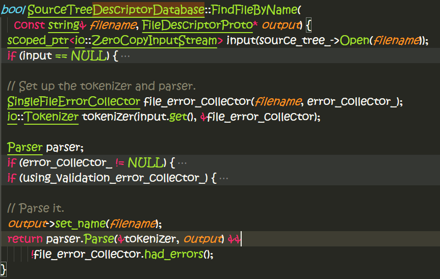

# protobuf-2.6.1源码阅读

## protoc程序

* main函数：
```c++
int main(int argc, char* argv[]) {

  google::protobuf::compiler::CommandLineInterface cli;
  cli.AllowPlugins("protoc-");

  // Proto2 C++
  google::protobuf::compiler::cpp::CppGenerator cpp_generator;
  cli.RegisterGenerator("--cpp_out", "--cpp_opt", &cpp_generator,
                        "Generate C++ header and source.");
```
支持C++的生成器，以proto文件作为输入。
proto文件示例：
```c++
syntax = "proto2";

package tutorial;

message Person {
  optional string name = 1;
  optional int32 id = 2;
  optional string email = 3;

  enum PhoneType {
    MOBILE = 0;
    HOME = 1;
    WORK = 2;
  }

  message PhoneNumber {
    optional string number = 1;
    optional PhoneType type = 2 [default = HOME];
  }

  repeated PhoneNumber phones = 4;
}

message AddressBook {
  repeated Person people = 1;
}
```
command line as below:
`protoc --cpp_out=outdir --proto_path=src src/foo.proto`

`RegisterGenerator`函数实现：
```c++
void CommandLineInterface::RegisterGenerator(const string& flag_name,
                                             CodeGenerator* generator,
                                             const string& help_text) {
  GeneratorInfo info;
  info.flag_name = flag_name;
  info.generator = generator;
  info.help_text = help_text;
  generators_by_flag_name_[flag_name] = info;
}

struct GeneratorInfo {
    string flag_name;
    string option_flag_name;
    CodeGenerator* generator;
    string help_text;
  };
  typedef map<string, GeneratorInfo> GeneratorMap;
  GeneratorMap generators_by_flag_name_;
```
将generator作为输入，存入一个map中。

```c++
vector<string> input_files_;                // Names of the input proto files.
```
`CommandLineInterface`中的`input_files_`用来存储用户输入的所有的proto文件路径。

**--proto_path**
```c++
proto_path_.push_back(pair<string, string>(virtual_path, disk_path));
```

`Run`函数的流程如下：

* 解析参数，获取用户输入的proto文件；
* 建立source tree；
* 分析每一个proto文件；
* 产生输出；


几个重要的类：
1. `Importer`
2. `FileDescriptor`
3. `GeneratorContextImpl` (基类：`GeneratorContext`)
4. `CppGenerator` (基类：`CodeGenerator`)
5. `SourceTreeDescriptorDatabase`

类`GeneratorContextImpl`比较简单，继承于`GeneratorContext`接口类，实现了几个虚接口函数。
```c++
  map<string, string*> files_;  // 文件路径到生成的文件内容
  const vector<const FileDescriptor*>& parsed_files_;
  bool had_error_;
```
它的`WriteAllToDisk`函数相当简单，就是将上述的所有文件内容刷到磁盘，open=> write => close。

file： src\google\protobuf\compiler\code_generator.h，定义了接口类：`CodeGenerator`
file： src\google\protobuf\compiler\cpp\cpp_generator.cc，针对C++定义了类`CppGenerator`，实现了上述接口类`CodeGenerator`的`Generate`函数：
```c++
  virtual bool Generate(const FileDescriptor* file,
                        const string& parameter,
                        GeneratorContext* generator_context,
                        string* error) const = 0;
```

`Importer`仅仅是对`SourceTreeDescriptorDatabase`的简单封装，后者继承于`DescriptorDatabase`

`SourceTree` => `DiskSourceTree`
`io::ZeroCopyInputStream` => `io::FileInputStream`
file: src\google\protobuf\io\zero_copy_stream.h, 定义了基类：
`io::ZeroCopyInputStream`和`io::ZeroCopyOutputStream`
file: src\google\protobuf\io\zero_copy_stream_impl.h，定义了子类:
`io::FileInputStream`和`io::FileOutputStream`

google的代码是非常严谨的。一个文件close都进行这样的认真的处理：
file： src\google\protobuf\io\zero_copy_stream_impl.cc
```c++
// EINTR sucks.
int close_no_eintr(int fd) {
  int result;
  do {
    result = close(fd);
  } while (result < 0 && errno == EINTR);
  return result;
}
```
一个典型的unix file descritor读取操作：
```c++
nt FileInputStream::CopyingFileInputStream::Read(void* buffer, int size) {
  GOOGLE_CHECK(!is_closed_);

  int result;
  do {
    result = read(file_, buffer, size);
  } while (result < 0 && errno == EINTR);

  if (result < 0) {
    // Read error (not EOF).
    errno_ = errno;
  }

  return result;
}
```

- `FileInputStream`的全部接口实现，转调用到`CopyingInputStreamAdaptor`的接口实现；
- `CopyingInputStreamAdator`又是基于`CopyingInputStream`读取功能来实现的；
- `FileInputStream`类提供了嵌入类`CopyFileInputStream`，继承于`CopyingInputStream`来实现读取功能；
- `CopyingInputStreamAdator`实现具体buffer分配管理和调用`CopyingInputStream`的接口进行读取；

`ZeroCopyInputStream`提供的接口如下：
```c++
  bool Next(const void** data, int* size);
  void BackUp(int count);
  bool Skip(int count);
  int64 ByteCount() const;
```


`Importer`内含`SourceTreeDescriptorDatabase`和`DescriptorPool`，构造函数如下：
```c++
Importer::Importer(SourceTree* source_tree,
                   MultiFileErrorCollector* error_collector)
  : database_(source_tree),
    pool_(&database_, database_.GetValidationErrorCollector()) {
  pool_.EnforceWeakDependencies(true);
  database_.RecordErrorsTo(error_collector);
}
```
导入一个proto文件，做的事情直接转调用到pool的接口函数：
```c++
const FileDescriptor* Importer::Import(const string& filename) {
  return pool_.FindFileByName(filename);
}
```

DescriptorPool最终会调用到database的接口函数去parse输入的proto文件：
```c++
bool DescriptorPool::TryFindFileInFallbackDatabase(const string& name) const {
  if (fallback_database_ == NULL) return false;

  if (tables_->known_bad_files_.count(name) > 0) return false;

  FileDescriptorProto file_proto;
  if (!fallback_database_->FindFileByName(name, &file_proto) ||
      BuildFileFromDatabase(file_proto) == NULL) {
    tables_->known_bad_files_.insert(name);
    return false;
  }
  return true;
}
```

子类`SourceTreeDescriptorDatabase`将会打开输入的proto文件，然后进行Tokenize，之后再传入`Parser`进行parse，输出将会是`FileDescriptorProto`类型。


如何tokenizer和parsing，请参考note-tokenizer.md文件。

假如说我们现在已经parse出一个FileDescriptorProto，我们就要以它作为输入BuildFile : FileDescriptor。
```c++
const FileDescriptor* DescriptorPool::BuildFileFromDatabase(
    const FileDescriptorProto& proto) const {
  mutex_->AssertHeld();
  if (tables_->known_bad_files_.count(proto.name()) > 0) {
    return NULL;
  }
  const FileDescriptor* result =
      DescriptorBuilder(this, tables_.get(),
                        default_error_collector_).BuildFile(proto);
  if (result == NULL) {
    tables_->known_bad_files_.insert(proto.name());
  }
  return result;
}
```
`FileDescriptorProto*` => `FileDescriptor*`
