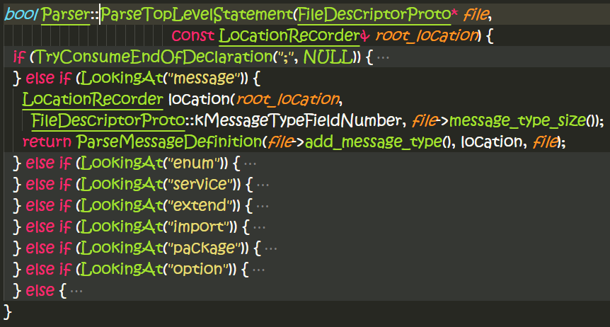
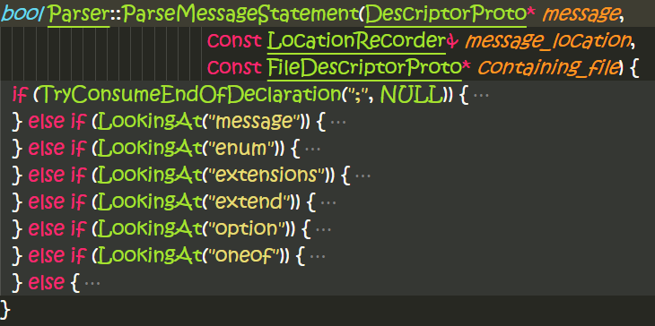

# protobuf-2.6.1源码阅读

## Tokenizer的代码阅读
file: src\google\protobuf\io\tokenizer.h
file: src\google\protobuf\io\tokenizer.cc

class `Tokenizer`，基于输入流：`ZeroCopyInputStream`，被接下来的`Parser`调用。
`Parser`定义在：src\google\protobuf\compiler\parser.h
它的最重要的接口如下：
`bool Parse(io::Tokenizer* input, FileDescriptorProto* file);`

这个就是起点。

`Token`的定义：
```c++
struct Token {
    // token类型与文本字符串
    TokenType type;
    string text;

    // token所在位置信息
    int line;
    int column;
    int end_column;
}
enum TokenType {
    TYPE_START,
    TYPE_END,

    TYPE_IDENTIFIER,
    TYPE_FLOAT,
    TYPE_STRING,
    TYPE_SYMBOL,
}
```
Tokenizer里面肯定包含一个叫做current的token，代表当前scan到哪一个token.


Parser的Parse函数主要做下面的事情：
```c++
    // Repeatedly parse statements until we reach the end of the file.
    while (!AtEnd()) {
      if (!ParseTopLevelStatement(file, root_location)) {
        // This statement failed to parse.  Skip it, but keep looping to parse
        // other statements.
        SkipStatement();

        if (LookingAt("}")) {
          AddError("Unmatched \"}\".");
          input_->NextWithComments(NULL, NULL, &upcoming_doc_comments_);
        }
      }
    }
```

这个是parse顶层的语句，可以看到顶层有好多种语句可以支持，其中有我们熟悉的`Message`语句，这是用来一个消息结构体。下面我们主要来看这个结构体是如何解析出来的。
```c++
inline bool Parser::LookingAt(const char* text) {
  return input_->current().text == text;
}
```
LookingAt是判断当前token文本是否是我们想要的字符串。
主要来看学习下`ParseMessageDefinition`函数，以后我们会回过头来学习下类`LocationRecorder`的实现。
```c++
bool Parser::ParseMessageDefinition(
    DescriptorProto* message,
    const LocationRecorder& message_location,
    const FileDescriptorProto* containing_file) {
  DO(Consume("message"));
  {
    LocationRecorder location(message_location,
                              DescriptorProto::kNameFieldNumber);
    location.RecordLegacyLocation(
        message, DescriptorPool::ErrorCollector::NAME);
    DO(ConsumeIdentifier(message->mutable_name(), "Expected message name."));
  }
  DO(ParseMessageBlock(message, message_location, containing_file));
  return true;
}
```
譬如parse下面的Message结构体定义：
```sh
message Person {
  optional string name = 1;
  optional int32 id = 2;
  optional string email = 3;
}
```
- 首先把"message"字符串吞掉：`DO(Consume("message"));`;
- 然后吞掉“Person”标识符：`DO(ConsumeIdentifier(message->mutable_name(), "Expected message name."));`，并把标识符作为名字存入message结构体；
- 最后就是消息block: `DO(ParseMessageBlock(message, message_location, containing_file));`;
- 注意这里的`DescriptorProto`和`FileDescriptorProto`本身也是一个proto描述的对象转成的C++对象。（如何实现自举？？？）

parser吞掉一个字符串实现如下：
```c++
bool Parser::TryConsume(const char* text) {
  if (LookingAt(text)) {
    input_->Next();
    return true;
  } else {
    return false;
  }
}

bool Parser::Consume(const char* text) {
  if (TryConsume(text)) {
    return true;
  } else {
    AddError("Expected \"" + string(text) + "\".");
    return false;
  }
}
```
基本上就是查看当前是否是想要吞掉的字符串，如果是，则告诉tokenizer前进到下一个token。
```c++
bool Parser::ConsumeIdentifier(string* output, const char* error) {
  if (LookingAtType(io::Tokenizer::TYPE_IDENTIFIER)) {
    *output = input_->current().text;
    input_->Next();
    return true;
  } else {
    AddError(error);
    return false;
  }
}
```
`ConsumeIdentifier`的实现也比较类似，就是判断当前token是否是IDENTIFIER，如果是，则提取identifier，然后告诉tokenier前进到下一个token，否则就是一个错误。
```c++
bool Parser::ParseMessageBlock(DescriptorProto* message,
                               const LocationRecorder& message_location,
                               const FileDescriptorProto* containing_file) {
  DO(ConsumeEndOfDeclaration("{", &message_location));

  while (!TryConsumeEndOfDeclaration("}", NULL)) {
    if (AtEnd()) {
      AddError("Reached end of input in message definition (missing '}').");
      return false;
    }

    if (!ParseMessageStatement(message, message_location, containing_file)) {
      // This statement failed to parse.  Skip it, but keep looping to parse
      // other statements.
      SkipStatement();
    }
  }

  if (message->extension_range_size() > 0) {
    AdjustExtensionRangesWithMaxEndNumber(message);
  }
  return true;
}
```
`ParseMessageBlock`实现也中规中矩，显示吞掉"{"，然后循环查看是否到了它匹配的"}"了。期间判断每一条语句：`ParseMessageStatement`。
Message里面可定义很多种语句：

- 可嵌套定义`message`;
- 可定义`enum`;
- 可定义`extensions`;
- 可定义`extend`;
- 可定义`option`;
- 可定义`oneof`;
- 正常的message field:
```c++
    LocationRecorder location(message_location,
                              DescriptorProto::kFieldFieldNumber,
                              message->field_size());
    return ParseMessageField(message->add_field(),
                             message->mutable_nested_type(),
                             message_location,
                             DescriptorProto::kNestedTypeFieldNumber,
                             location,
                             containing_file);
```
`optional string name = 1;`
- 'optional' => label；可以是'optional', 'repeated', 'required'
- 'string' => type;
- 'name' => identifier;
- '1' => field number;

ParseLabel实现：
```c++
bool Parser::ParseLabel(FieldDescriptorProto::Label* label,
                        const FileDescriptorProto* containing_file) {
  if (TryConsume("optional")) {
    *label = FieldDescriptorProto::LABEL_OPTIONAL;
    return true;
  } else if (TryConsume("repeated")) {
    *label = FieldDescriptorProto::LABEL_REPEATED;
    return true;
  } else if (TryConsume("required")) {
    *label = FieldDescriptorProto::LABEL_REQUIRED;
    return true;
  } else {
    AddError("Expected \"required\", \"optional\", or \"repeated\".");
    // We can actually reasonably recover here by just assuming the user
    // forgot the label altogether.
    *label = FieldDescriptorProto::LABEL_OPTIONAL;
    return true;
  }
}
```
很简单，判断当前token字符串是否想要的那几种label；

```c++
bool Parser::ParseMessageField(FieldDescriptorProto* field,
                               RepeatedPtrField<DescriptorProto>* messages,
                               const LocationRecorder& parent_location,
                               int location_field_number_for_nested_type,
                               const LocationRecorder& field_location,
                               const FileDescriptorProto* containing_file) {
  {
    LocationRecorder location(field_location,
                              FieldDescriptorProto::kLabelFieldNumber);
    FieldDescriptorProto::Label label;
    DO(ParseLabel(&label, containing_file));
    field->set_label(label);
  }

  return ParseMessageFieldNoLabel(field, messages, parent_location,
                                  location_field_number_for_nested_type,
                                  field_location,
                                  containing_file);
}
```
ParseMessageField => 先解析label，然后是其它域。
FieldDescriptorProto类定义下面几个：
- label
- type
- identifier
- number
- option
`optional PhoneType type = 2 [default = HOME];`
最后的[]括起来的default就是option。

`DescriptorProto`结构体message，就是很多个field的列表。
`FileDescriptorProto`结构体file， 里面可以定义message，enum，import，etc；
现在假设`ParseTopLevelStatement`函数已经执行完成，整个file已经分析完成。
也就是说`FileDescriptorProto`已经populate成功。
