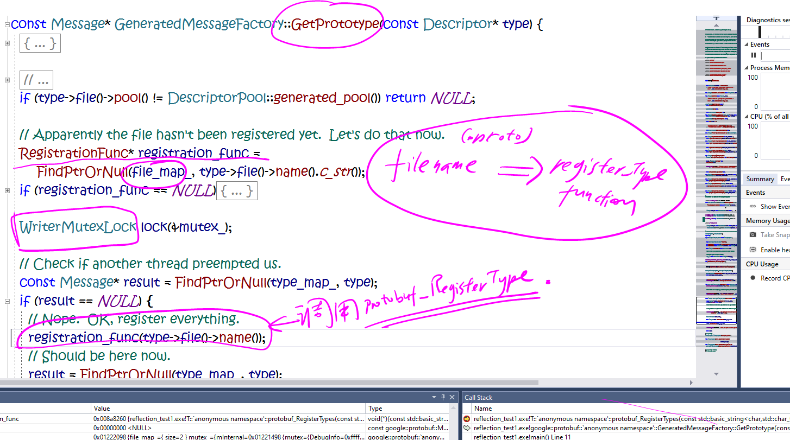
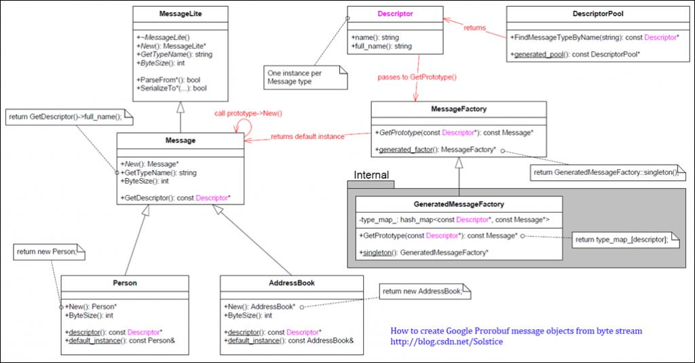

有2种方式来使用protobuf提供的类的反射机制。
加入我们已经有一个test.pb文件：
```c++
package T;
message Test
{
    optional int32 id = 1;
}
```

第一种方式:
===
1. 用protc编译器将上面的test.pb编译器成test.pb.h和test.pb.cc文件，然后添加到一个项目中：
**main.cc**
```c++
#include <google/protobuf/descriptor.h>
#include <google/protobuf/message.h>
#include "test.pb.h"  // 将 test.pb.h/cc也添加进来参与编译
#include <cassert>
#include <iostream>

int main()
{
    auto descriptor = google::protobuf::DescriptorPool::generated_pool()->FindMessageTypeByName("T.Test");
    assert(descriptor);
    auto prototype = google::protobuf::MessageFactory::generated_factory()->GetPrototype(descriptor);
    assert(prototype);

    auto message = prototype->New();
    auto test = dynamic_cast<T::Test*>(message);
    test->set_id(1);
    std::cout << test->DebugString() << std::endl;
    delete message;
    return 0;
}
```
- test.pb.cc文件中静态定义了一个变量，它会在程序启动时进行初始化，然后调用一个静态静态函数注册proto编码内容到一个注册函数：
```c++
void protobuf_AddDesc_test_2eproto() {
  static bool already_here = false;
  if (already_here) return;
  already_here = true;
  GOOGLE_PROTOBUF_VERIFY_VERSION;

  // 注册proto文件和内容（serialized编码之后的）
  // 这样调用`FindMessageTypeByName`将会对应的message descriptor
  ::google::protobuf::DescriptorPool::InternalAddGeneratedFile(
    "\n\ntest.proto\022\001T\"\022\n\004Test\022\n\n\002id\030\001 \001(\005", 35);
  // 注册proto文件内容（serialized编码之后的）=> 注册proto文件定义的所有的message类型函数
  // 底层会有一个`file_map_`的hash map来存储这样的注册项
  ::google::protobuf::MessageFactory::InternalRegisterGeneratedFile(
    "test.proto", &protobuf_RegisterTypes);
  // 然后创建一个message类对象，作为这个类的prototype
  // 之后从prototype调用New()，其实都是直接调用message类的New函数生成一个全新的message类对象。
  Test::default_instance_ = new Test();
  Test::default_instance_->InitAsDefaultInstance();
  // 注册库shutdown时做的一些操作，包括删除这个default_instance对象。
  ::google::protobuf::internal::OnShutdown(&protobuf_ShutdownFile_test_2eproto);
}

// Force AddDescriptors() to be called at static initialization time.
struct StaticDescriptorInitializer_test_2eproto {
  StaticDescriptorInitializer_test_2eproto() {
    protobuf_AddDesc_test_2eproto();
  }
} static_descriptor_initializer_test_2eproto_;
```

`protobuf_RegisterTypes`函数定义如下：
```c++
void protobuf_RegisterTypes(const ::std::string&) {
  protobuf_AssignDescriptorsOnce();
  // 绑定类descriptor和它的prototype（其实就是上面创建的default_instance对象）
  // 上面main中调用`generated_factory()->GetPrototype`将会找到对应的prototype
  // 其实底层就是用一个hash map来存储descriptor => prototype的映射
  ::google::protobuf::MessageFactory::InternalRegisterGeneratedMessage(
    Test_descriptor_, &Test::default_instance());
}
```
那么这个函数是在什么时候被调用的呢？


根据类名 => 找到定义它的file descriptor/file name => 同时也找到message descriptor
根据file name => 找到注册的register message type函数；
    register message type函数会帮忙绑定message descriptor => message prototype
根据message descriptor => 找到它的prototype，如果没找到，则调用注册的register message type函数，绑定两者。
有了message prototype就可以New()出一个全新的message对象，然后对它进行修改/序列化。

上述过程的关键就是test.pb.cc将原始的proto编码文件内容也写在了cc文件中，并在程序一开始向protobuf库进行了注册，那么protobuf就有能力进行decode，然后解析出里面定义的message结构，生成每个message对应的descriptor。当然最外层的就是file descriptor。

第二种方式：
===
假设我们有test.pb文件，这次我们并不offline将它编译test.pb.h和test.pb.cc，而是在下面程序中直接动态编译。
```c++
#include <iostream>
#include <google/protobuf/compiler/importer.h>
#include <google/protobuf/dynamic_message.h>

int main()
{
    google::protobuf::compiler::DiskSourceTree sourceTree;
    sourceTree.MapPath("project_root", "../../");
    google::protobuf::compiler::Importer importer(&sourceTree, nullptr);
    importer.Import("project_root/test.proto");  // 进行动态编译，放入descriptorPool中
    auto descriptor1 = importer.pool()->FindMessageTypeByName("T.Test");

    google::protobuf::DynamicMessageFactory factory;
    auto proto1 = factory.GetPrototype(descriptor1);
    auto message1 = proto1->New();  // **** 注意，这里没有创建一个Test对象，proto1不是Test类的default_instance****
    auto reflection1 = message1->GetReflection();  // 每个message对象都可以直接拿到它的反射对象
    auto field1 = descriptor1->FindFieldByName("id");  // 通过message descriptor拿到每个域的field descriptor
    reflection1->SetInt32(message1, field1, 1);
    std::cout << message1->DebugString() << std::endl;
    delete message1;
    return 0;
}
```
其实我们可以合并第一种方式和第二种方式。我们可以直接创建一个T::Test对象，然后拿到它的descriptor和reflection对象，这是每一个message对象都有的接口。
```c++
#include "test.pb.h"

int main()
{
    T::Test test;
    auto descriptor = test.GetDescriptor();
    auto reflection = test.GetReflection();
    auto field = descriptor->FindFieldByName("id");
    reflection->SetInt32(&test, field, 5);
    std::cout << reflection->GetInt32(test, field) << std::endl;
}
```

```c++
  ::google::protobuf::DescriptorPool::InternalAddGeneratedFile(
    "\n\ntest.proto\022\001T\"\022\n\004Test\022\n\n\002id\030\001 \001(\005", 35);
```
其实是在protoc生成代码中hard code了对应proto文件的file descriptor包序列化之后的数据，作为参数直接使用。

**offset**
任何一个对象都对应一个内存，有内存起始和结束地址。而对象的每一个属性，都位于start_addr + $offset，所以当对象和对应属性的offset已知的时候，属性的内存地址就是可以获取的。

```c++
void protobuf_AssignDesc_test_2eproto() {
  protobuf_AddDesc_test_2eproto();
  const ::google::protobuf::FileDescriptor* file =
    ::google::protobuf::DescriptorPool::generated_pool()->FindFileByName(
      "test.proto");
  GOOGLE_CHECK(file != NULL);
  Test_descriptor_ = file->message_type(0);
  static const int Test_offsets_[1] = {
    GOOGLE_PROTOBUF_GENERATED_MESSAGE_FIELD_OFFSET(Test, id_),
  };
  Test_reflection_ =
    new ::google::protobuf::internal::GeneratedMessageReflection(
      Test_descriptor_,
      Test::default_instance_,
      Test_offsets_,
      GOOGLE_PROTOBUF_GENERATED_MESSAGE_FIELD_OFFSET(Test, _has_bits_[0]),
      GOOGLE_PROTOBUF_GENERATED_MESSAGE_FIELD_OFFSET(Test, _unknown_fields_),
      -1,
      ::google::protobuf::DescriptorPool::generated_pool(),
      ::google::protobuf::MessageFactory::generated_factory(),
      sizeof(Test));
}
```

```c++
#define GOOGLE_PROTOBUF_GENERATED_MESSAGE_FIELD_OFFSET(TYPE, FIELD)    \
  static_cast<int>(                                           \
      reinterpret_cast<const char*>(                          \
          &reinterpret_cast<const TYPE*>(16)->FIELD) -        \
      reinterpret_cast<const char*>(16))
```
为啥是16呢，不是0？我们通常获取偏移值是这样做的
`(size_t)&(((Type*)0)->FIELD)`

protobuf对这个代码片段的注释是这样的：
```c++
// Returns the offset of the given field within the given aggregate type.
// This is equivalent to the ANSI C offsetof() macro.  However, according
// to the C++ standard, offsetof() only works on POD types, and GCC
// enforces this requirement with a warning.  In practice, this rule is
// unnecessarily strict; there is probably no compiler or platform on
// which the offsets of the direct fields of a class are non-constant.
// Fields inherited from superclasses *can* have non-constant offsets,
// but that's not what this macro will be used for.
//
// Note that we calculate relative to the pointer value 16 here since if we
// just use zero, GCC complains about dereferencing a NULL pointer.  We
// choose 16 rather than some other number just in case the compiler would
// be confused by an unaligned pointer.
```
WIKI(https://en.wikipedia.org/wiki/Offsetof)列出了几种实现方式：
```c++
// 一般的实现方式：
#define offsetof(st, m) \
    ((size_t)&(((st *)0)->m))

// 另一个实现方式：
#define offsetof(st, m) \
    ((size_t)((char *)&((st *)0)->m - (char *)0))

// GCC
#define offsetof(st, m) \
    __builtin_offsetof(st, m)

// linux kernel用offset来实现 container_of宏：
#define container_of(ptr, type, member) ({ \
                const typeof( ((type *)0)->member ) *__mptr = (ptr); \
                (type *)( (char *)__mptr - offsetof(type,member) );})
// 比如下面这样：
struct my_struct {
    const char *name;
    struct list_node list;
};

extern struct list_node * list_next(struct list_node *);

struct list_node *current = /* ... */
while (current != NULL) {
    struct my_struct *element = container_of(current, struct my_struct, list);
    printf("%s\n", element->name);
    current = list_next(&element->list);
}

// 实现1
#define container_of(ptr, type, member) \
    ((type *)((char *)(1 ? (ptr) : &((type *)0)->member) - offsetof(type, member)))

// 实现2
#define container_of(ptr, type, member) \
    ((type *)((char *)(ptr) - offsetof(type, member)))
```
但是linux kernel对`container_of`的实现方式更安全，因为它会进行类型检查。
>the compiler must perform a check to ensure that (ptr) and &((type *)0)->member are both compatible pointer types.


所有的Descriptor存储在单例的DescriptorPool 中。google::protobuf::DescriptorPool::generated_pool()来获取他的指针。
所有的instance 存储在单例的MessageFactory中。google::protobuf::MessageFactory::generated_factory()来获取他的指针。

```c++
// Message基类
const Descriptor* GetDescriptor() const { return GetMetadata().descriptor; }
virtual const Reflection* GetReflection() const {
    return GetMetadata().reflection;
  }
virtual Metadata GetMetadata() const  = 0;
```

Test子类都已经写好了`GetMetaData`函数：
```c++
::google::protobuf::Metadata Test::GetMetadata() const {
  protobuf_AssignDescriptorsOnce();  // 这里又调用了，
  ::google::protobuf::Metadata metadata;
  metadata.descriptor = Test_descriptor_;
  metadata.reflection = Test_reflection_;
  return metadata;
}
```
这个函数就是初始化2个全局数据：`Test_descriptor_`和`Test_reflection_`。


