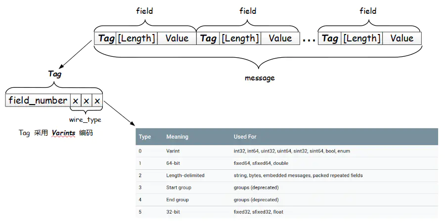

# protobuf-2.6.1源码阅读

## libprotobuf中的编码

一个简单的 Message
```sh
message Test1 {
    optional int32 a = 1;
}
```
序列化之后的二进制数据位: `08 96 01`

### Base 128 Varints （编码方法）
所谓的varints是一种用一个或多个字节序列化编码整数的方法。较小的数字将占用较小的字节数。
varint中的每个字节都设置了一个标志位(msb) - msb表示后买你还有字节需要读取(当前编码还未结束)。
每个字节的低7位用于以7位一组的方式存储数字的二进制补码，二进制补码的低位排在编码序列的前头。
**可以总结出varint编码最主要的三点：**
- 存储数字对应的二进制补码；
- 在每个字节开头设置了msb，标识是否需要继续读取下一个字节；
- 补码的低位排在前面？=> 这个怎么理解？

举个例子：数字1该如何编码 - 这只需要单个字节，无需设置msb：`0000 0001`。
复杂点的例子：数字300该如何编码：（从左开始存储低位数字）
`1010 1100 0000 0010`
如何得出是数字300呢？
首先将每个字节的msb位去掉，
`1010 1100` => ` 010 1100` (去掉msb = 1) => 原始数字中的第1个7位
`0000 0010` => ` 000 0010` （去掉msb = 0)  => 原始数字中的第2个7位
进行拼接：000 0010 010 1100 => 00 001 0010 1100 => 1 0010 1100 => 256 + 32 + 8 + 4 = 300


### Message 结构
一个protobuf message实际上一些列的键值对，消息的二进制版本只使用字段的数字作为key ---- 而每个字段的名称和声明的类型只能通过引用message类型的定义在解码端确定。
在对一个message进行编码时，其键值将连接成字节流。**在解码消息时，解析器需要能够跳过它无法识别的字段**。这样将新字段添加到消息中，而不会破坏那些无法识别（新字段）的旧程序。为此，识别message编码中每个字段的key实际上是两个值 - 来自.proto文件的字段编号，以及一个提供足够信息以查找“值的（字节）长度”的类型。
|Type	|Meaning	|Used For |
| --- | --- | --- |
|0|	Varint	| int32, int64, uint32, uint64, sint32, sint64, bool, enum |
|1|	64-bit	| fixed64, sfixed64, double |
|2|	Length-delimited	| string, bytes, embedded messages, packed repeated fields |
|3|	Start group	| groups (deprecated,遗弃) |
|4|	End group	| groups (deprecated,遗弃) |
|5|	32-bit	| fixed32, sfixed32, float |
message 消息流中的每个 Tag (field_number + wire_type) 都使用 varint 进行编码，且最后三位 bit 存储类型 wire_type（其它位存储字段编号 field_number）

### 更多的值类型
* signed integers
有符号整数，如果使用int32或int64作为负数的类型，则生成的varint总是10个字节长，它被视为一个很大的无符号数。如果使用signed int(sint32/sint64)，则生成的varint将使用ZigZag编码，这样效率更高。
> 如果是负数，那么必须有最高位表示符号位，也就是说天然的会用尽所有字节。
> 如果是 4 个字节的 int，那么负数总是要占 4 个字节。可以为什么 int32 会占十个字节呢？不是应该占 5 个字节吗（每个字节还需要拿出一个 bit 位做 msb，所以要 5 个字节）？
> 这里是 protobuf 为了兼容性做的一种措施，为了 int32 和 int64 能够兼容（比如在 .proto 文件中将 int32 改成 int64），所以 int32 的负数会扩展到 int64 的长度。
> 那么正数的兼容呢？请仔细品味上述的 varints 编码，这种编码天然使得 int32 和 int64 的正数兼容。

ZigZag编码将有符号整数映射到无符号整数，因此具有较小绝对值（例如-1）的数字也具有较小的varint编码值。它通过正负整数”zig-zag”的方式做到这一点，因此-1被编码位1，1被编码位2，-2被编码为3，如同下表：
| Signed Original	| Encoded As |
| --- | --- |
| 0	| ０|
|-1	| 1|
|1	| 2|
|-2	| 3|
|2	| 4|
|...|	...|
|2147483647	|4294967294|
|-2147483648 |	4294967295|
换句话说，每个sint32类型的n编码处理如下：
```(n << 1) ^ (n >> 31)```
其中n >> 31是算术右移，基本上它就是会变成-1（对于n是负数的情况），变成0（对于n是正数的情况）。
每个sint64类型的n编码处理如下：
```(n << 1) ^ (n >> 63)```

### non-varint numbers
double和fixed64对应的类型，是固定的，告诉解析器读取一个固定的64位的数据块。
float和fixed32对应的类型，也是固定的，读取一个固定的32位的数据块。

### 字符串
类型为2，表示接下来的字节将是varint编码的长度，之后跟指定长度的数据字节。
```sh
message Test2 {
    optional string b = 2;
}
```
编码如下：
```12 07 | 74 65 73 74 69 6e 67```
- 后七个字节为 "testing" 的 UTF8 编码
- 第1个字节0x12 （0001 0010）为key，字段便阿门field_number = 2，类型为2 (后3位);
- varint值的长度为7，后面有7个字节，代表字符串。

### 嵌入消息类型
```c++
message Test3 {
  optional Test1 c = 3;
}
message Test1 {
    optional int32 a = 1;
}
```
编码如下：
`1a 03 08 96 01`
- 03代表字节长度 => 嵌入消息的处理方式与字符串相同，后面字符串内容就是Test1的编码结果。

### reference：
https://www.jianshu.com/p/82ff31c6adc6
https://developers.google.com/protocol-buffers/docs/encoding

XML、JSON、ProtoBuf 都具有数据结构化和数据序列化的能力
XML、JSON 更注重数据结构化，关注人类可读性和语义表达能力。ProtoBuf 更注重数据序列化，关注效率、空间、速度，人类可读性差，语义表达能力不足（为保证极致的效率，会舍弃一部分元信息）
ProtoBuf 的应用场景更为明确，XML、JSON 的应用场景更为丰富。


