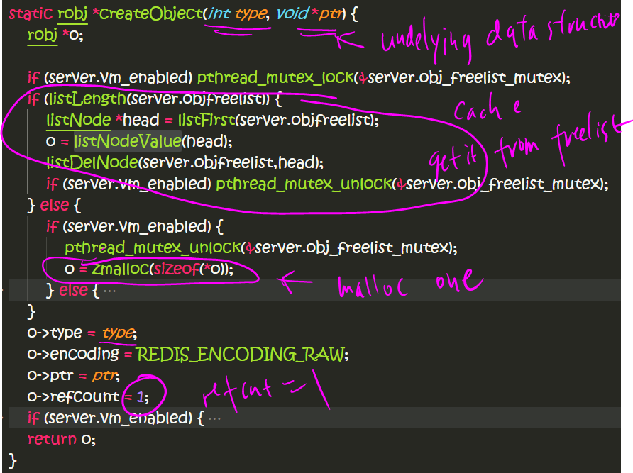
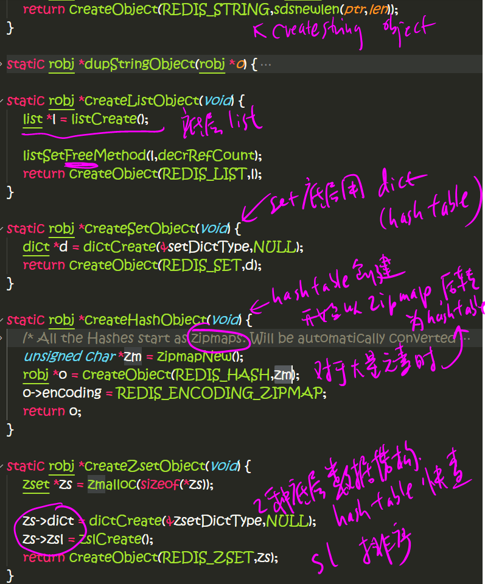
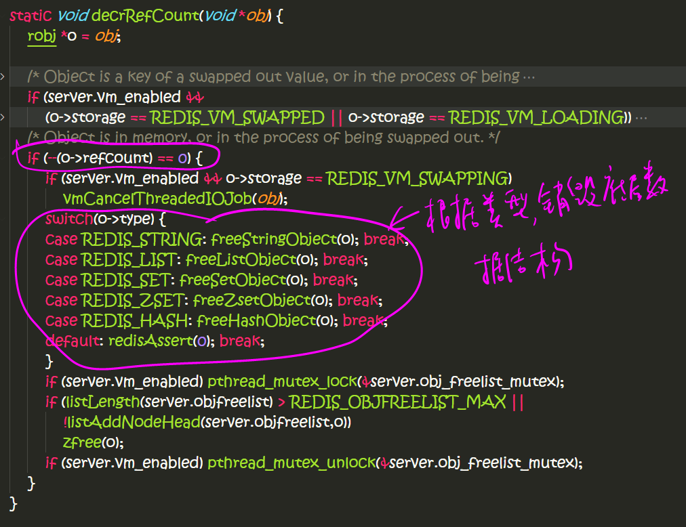
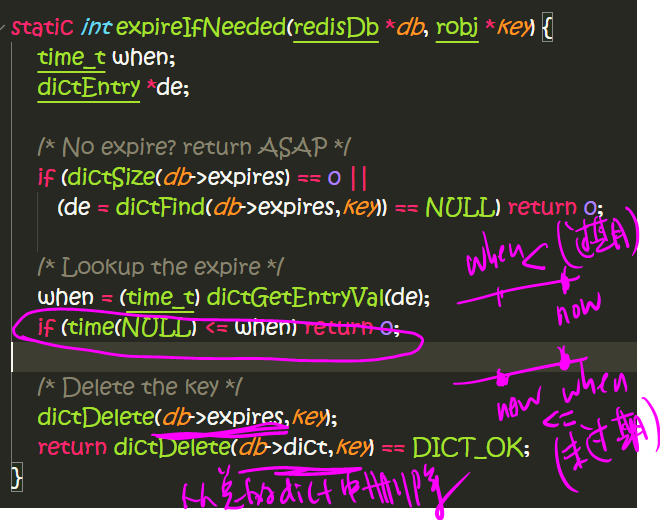
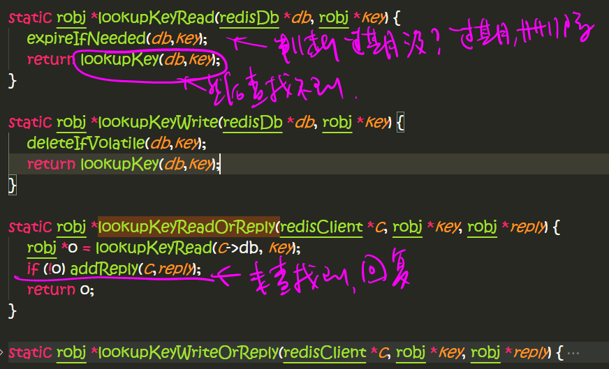
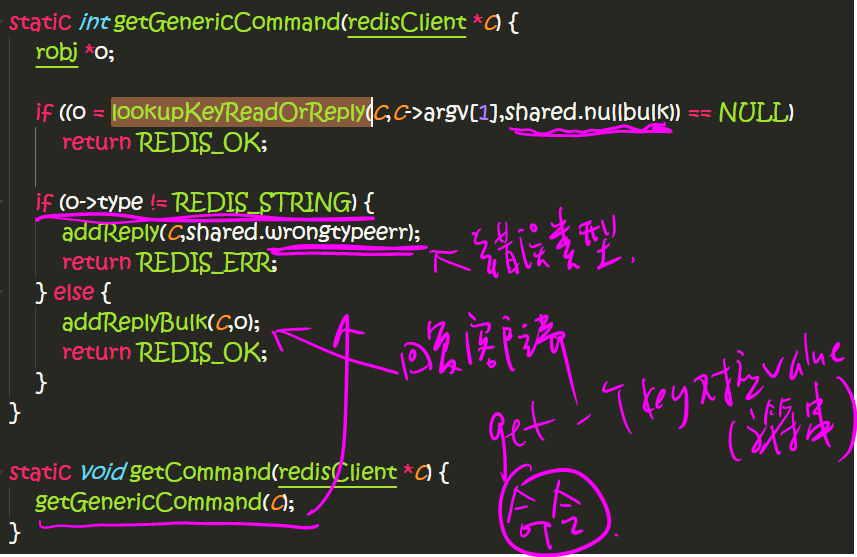
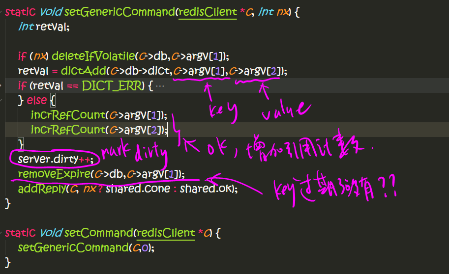

redis-1.3.7定义了下面几种值对象类型，键对象类型总是字符串
```c++
#define REDIS_STRING 0
#define REDIS_LIST 1
#define REDIS_SET 2
#define REDIS_ZSET 3
#define REDIS_HASH 4
```
字符串，列表，集合，有序集合，和哈希表

有些对象类型，底层可以由几种数据结构表示方式：
```c++
/* Objects encoding. Some kind of objects like Strings and Hashes can be
 * internally represented in multiple ways. The 'encoding' field of the object
 * is set to one of this fields for this object. */
#define REDIS_ENCODING_RAW 0    /* Raw representation */
#define REDIS_ENCODING_INT 1    /* Encoded as integer */
#define REDIS_ENCODING_ZIPMAP 2 /* Encoded as zipmap */
#define REDIS_ENCODING_HT 3     /* Encoded as an hash table */
```
采用不同的数据结构表示，取决于在不同的使用场景，从而达到不同场景下的高效。

**redisObject类**
```c++
struct redisObject {
    void* ptr;
    unsigned char type;
    unsigned char encoding;
    unsigned char storage;
    unsigned char vtype;
    int refcount;
    ...
};
```








