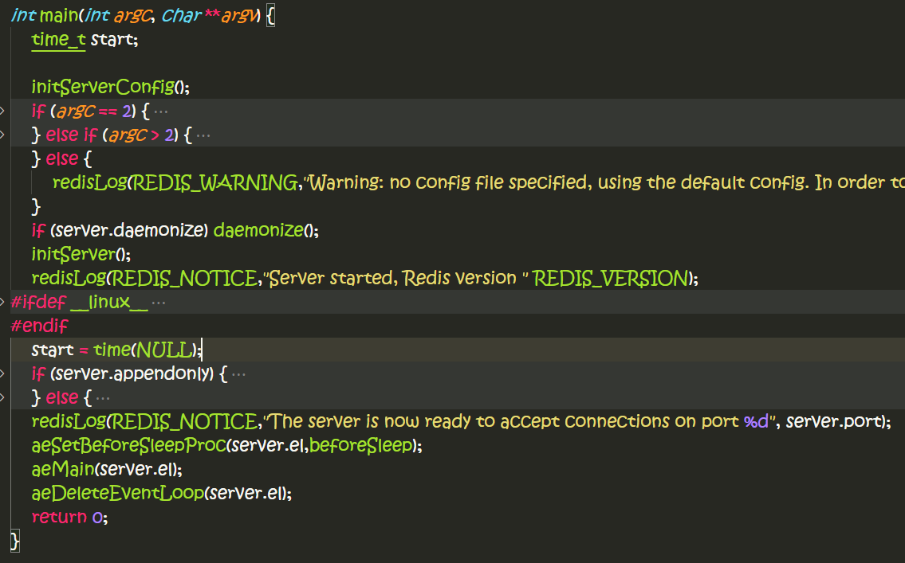

# 这个文档是讨论redis server如何工作的。
----------------
**file: redis.c**

直接贴上`main`函数代码：
```c
int main(int argc, char **argv) {
    time_t start;

    initServerConfig(); // 初始化server配置
    if (argc == 2) {
        resetServerSaveParams();
        loadServerConfig(argv[1]);  // 装载server配置
    } else if (argc > 2) {
        fprintf(stderr,"Usage: ./redis-server [/path/to/redis.conf]\n");
        exit(1);
    } else {
        redisLog(REDIS_WARNING,"Warning: no config file specified, using the default config. In order to specify a config file use 'redis-server /path/to/redis.conf'");
    }
    if (server.daemonize) daemonize();  // 是否要daemone?
    initServer();  // 初始化服务器
    redisLog(REDIS_NOTICE,"Server started, Redis version " REDIS_VERSION);
#ifdef __linux__
    linuxOvercommitMemoryWarning();
#endif
    start = time(NULL);
    if (server.appendonly) {  // replay file??
        if (loadAppendOnlyFile(server.appendfilename) == REDIS_OK)
            redisLog(REDIS_NOTICE,"DB loaded from append only file: %ld seconds",time(NULL)-start);
    } else {
        if (rdbLoad(server.dbfilename) == REDIS_OK)
            redisLog(REDIS_NOTICE,"DB loaded from disk: %ld seconds",time(NULL)-start);
    }
    redisLog(REDIS_NOTICE,"The server is now ready to accept connections on port %d", server.port);
    aeSetBeforeSleepProc(server.el,beforeSleep);
    aeMain(server.el);  // 进入事件循环？
    aeDeleteEventLoop(server.el);
    return 0;
}
```
执行流程基本如下：
- 初始化服务器配置
- 装载服务器配置
- 初始化服务器
- 从磁盘装载db文件
  - 要么装载AppendOnly文件，replay
  - 要么装载db数据文件
- 进入事件循环
- 销毁事件循环，退出


这里贴一段有趣的代码：
```c
    /* Double constants initialization */
    R_Zero = 0.0;
    R_PosInf = 1.0/R_Zero;
    R_NegInf = -1.0/R_Zero;
    R_Nan = R_Zero/R_Zero;
```

* 初始化服务器配置: `initServerConfig`
基本上函数是对`redisServer`数据结构进行初始化. `redisServer`是一个全局性的数据结构，里面存储着配置信息。
```c
static void initServerConfig() {
    server.dbnum = REDIS_DEFAULT_DBNUM;
    server.port = REDIS_SERVERPORT;
    server.verbosity = REDIS_VERBOSE;
    server.maxidletime = REDIS_MAXIDLETIME;
    server.saveparams = NULL;
    server.logfile = NULL; /* NULL = log on standard output */
    server.bindaddr = NULL;
    server.glueoutputbuf = 1;
    server.daemonize = 0;
    ...
```

* 装载服务器配置：`loadServerConfig`
这个函数要做的事情是从用户提供的配置文件中读取设置，然后对`redisServer`数据结构赋值。
配置文件基本上每行一个配置选项，参数名字，和它的参数配对：
```c
        /* Split into arguments */
        argv = sdssplitlen(line,sdslen(line)," ",1,&argc);
        sdstolower(argv[0]);

        /* Execute config directives */
        if (!strcasecmp(argv[0],"timeout") && argc == 2) {
            server.maxidletime = atoi(argv[1]);
            if (server.maxidletime < 0) {
                err = "Invalid timeout value"; goto loaderr;
            }
```

* 初始化服务器：`initServer`
这个函数主要是对`redisServer`数据结构进一步初始化，前面的初始化都是些配置参数，这次是重要的数据结构，譬如客户端连接对象维护列表，replication的slaves维护列表，事件循环引擎，服务器socket连接对象，等等。
```c++
static void initServer() {
    int j;

    // 信号处理
    signal(SIGHUP, SIG_IGN);
    signal(SIGPIPE, SIG_IGN);
    setupSigSegvAction();

    server.devnull = fopen("/dev/null","w");
    if (server.devnull == NULL) {
        redisLog(REDIS_WARNING, "Can't open /dev/null: %s", server.neterr);
        exit(1);
    }
    server.clients = listCreate();  // 客户端对象列表
    server.slaves = listCreate();  // replication slaves列表
    server.monitors = listCreate();
    server.objfreelist = listCreate();  // 对象自由列表
    createSharedObjects();
    server.el = aeCreateEventLoop();  // 事件循环引擎
    server.db = zmalloc(sizeof(redisDb)*server.dbnum);  // DB对象
    server.sharingpool = dictCreate(&setDictType,NULL);
    // socket连接套接字
    server.fd = anetTcpServer(server.neterr, server.port, server.bindaddr);
    if (server.fd == -1) {
        redisLog(REDIS_WARNING, "Opening TCP port: %s", server.neterr);
        exit(1);
    }
    // 初始化所有的db对象
    for (j = 0; j < server.dbnum; j++) {
        server.db[j].dict = dictCreate(&dbDictType,NULL);
        server.db[j].expires = dictCreate(&keyptrDictType,NULL);
        server.db[j].blockingkeys = dictCreate(&keylistDictType,NULL);
        if (server.vm_enabled)
            server.db[j].io_keys = dictCreate(&keylistDictType,NULL);
        server.db[j].id = j;
    }
    server.cronloops = 0;
    server.bgsavechildpid = -1;  // 后台进程pid
    server.bgrewritechildpid = -1;  // 后台replication 写进程pid
    server.bgrewritebuf = sdsempty();
    server.lastsave = time(NULL);  // 记录上次保存时间
    server.dirty = 0;
    // 统计相关数据
    server.stat_numcommands = 0;
    server.stat_numconnections = 0;
    server.stat_starttime = time(NULL);
    server.unixtime = time(NULL);
    // 创建定时器
    aeCreateTimeEvent(server.el, 1, serverCron, NULL, NULL);
    // 创建读事件
    if (aeCreateFileEvent(server.el, server.fd, AE_READABLE,
        acceptHandler, NULL) == AE_ERR) oom("creating file event");

    if (server.appendonly) {
        server.appendfd = open(server.appendfilename,O_WRONLY|O_APPEND|O_CREAT,0644);
        if (server.appendfd == -1) {
            redisLog(REDIS_WARNING, "Can't open the append-only file: %s",
                strerror(errno));
            exit(1);
        }
    }

    if (server.vm_enabled) vmInit();
}
```

* 读取AOF文件: `loadAppendOnlyFile`
```c++
        int argc, j;
        unsigned long len;
        robj **argv;
        char buf[128];
        sds argsds;
        struct redisCommand *cmd;

        if (fgets(buf,sizeof(buf),fp) == NULL) {
            if (feof(fp))
                break;
            else
                goto readerr;
        }
        if (buf[0] != '*') goto fmterr;
        argc = atoi(buf+1);
        argv = zmalloc(sizeof(robj*)*argc);
        for (j = 0; j < argc; j++) {
            if (fgets(buf,sizeof(buf),fp) == NULL) goto readerr;
            if (buf[0] != '$') goto fmterr;
            len = strtol(buf+1,NULL,10);
            argsds = sdsnewlen(NULL,len);
            if (len && fread(argsds,len,1,fp) == 0) goto fmterr;
            argv[j] = createObject(REDIS_STRING,argsds);
            if (fread(buf,2,1,fp) == 0) goto fmterr; /* discard CRLF */
        }

        /* Command lookup */
        cmd = lookupCommand(argv[0]->ptr);
        ...
```
从上面这段代码可知AOF的格式如下:
对于如下的命令:
```sh
SET mykey 8
myvalue
```
会被存储为:
```sh
*3  // 命令 + 参数个数一起总的个数
$3
SET
$5
mykey
$8
myvalue
```
第一个会是命令`argv[0]->ptr`字符串

装载AOF文件时，会创建一个faked client，假装有一个client在请求服务器执行那些命令。
```c++
/* Run the command in the context of a fake client */
        fakeClient->argc = argc;
        fakeClient->argv = argv;
        cmd->proc(fakeClient);
        /* Discard the reply objects list from the fake client */
        while(listLength(fakeClient->reply))
            listDelNode(fakeClient->reply,listFirst(fakeClient->reply));
        /* Clean up, ready for the next command */
        for (j = 0; j < argc; j++) decrRefCount(argv[j]);
        zfree(argv);
        ...
```

* 读取redis DB： `rdbLoad`
rdb是一个二进制文件，里面存储着snapshot of redis dataset in memory。redis是一个key-value（键值对) in memory服务器，故dump shapshot就会是key-value配对的数据文件。
```c++
    fp = fopen(filename,"r");
    if (!fp) return REDIS_ERR;
    if (fread(buf,9,1,fp) == 0) goto eoferr;
    buf[9] = '\0';
    if (memcmp(buf,"REDIS",5) != 0) {
        ...
    }
    rdbver = atoi(buf+5);
    if (rdbver != 1) {
        ...
    }
```
rdb文件以`REDIS`字符串作为文件签名，接着是version整型数字.
然后就是type + key-value的二进制数据，一个接着一个。
```c++
    while(1) {
        robj *o;

        /* Read type. */
        if ((type = rdbLoadType(fp)) == -1) goto eoferr;
        if (type == REDIS_EXPIRETIME) {
            if ((expiretime = rdbLoadTime(fp)) == -1) goto eoferr;
            /* We read the time so we need to read the object type again */
            if ((type = rdbLoadType(fp)) == -1) goto eoferr;
        }
        if (type == REDIS_EOF) break;
        /* Handle SELECT DB opcode as a special case */
        if (type == REDIS_SELECTDB) {
            if ((dbid = rdbLoadLen(fp,NULL)) == REDIS_RDB_LENERR)
                goto eoferr;
            if (dbid >= (unsigned)server.dbnum) {
                redisLog(REDIS_WARNING,"FATAL: Data file was created with a Redis server configured to handle more than %d databases. Exiting\n", server.dbnum);
                exit(1);
            }
            db = server.db+dbid;
            d = db->dict;
            continue;
        }
        /* Read key */
        if ((keyobj = rdbLoadStringObject(fp)) == NULL) goto eoferr;
        /* Read value */
        if ((o = rdbLoadObject(type,fp)) == NULL) goto eoferr;
        /* Add the new object in the hash table */
        retval = dictAdd(d,keyobj,o);
```
上述代码对expire time和db index数据有特别的type。
整个数据文件以`REDIS_EOF`类型作为文件结束符。

redis key-value中的key永远是字符串，所以它会先load字符串对象，然后是值对象，值对象会有很多种类型。装载它们之后，就会把它们添加到当前服务器的dict对象中。

装载类型函数，只会判断一个字节信息:
```c++
static int rdbLoadType(FILE *fp) {
    unsigned char type;
    if (fread(&type,1,1,fp) == 0) return -1;
    return type;
}
```

装载字符串类型数据：`rdbLoadStringObject`
1. 首先装载字符串长度，同时判断长度信息是否进行了特别编码
2. 根据编码方式和长度信息，进行不同的编码方法的字符串装载
```c++
static robj *rdbLoadStringObject(FILE*fp) {
    int isencoded;
    uint32_t len;
    sds val;

    len = rdbLoadLen(fp,&isencoded);
    if (isencoded) {
        switch(len) {
        case REDIS_RDB_ENC_INT8:
        case REDIS_RDB_ENC_INT16:
        case REDIS_RDB_ENC_INT32:
            return tryObjectSharing(rdbLoadIntegerObject(fp,len));
        case REDIS_RDB_ENC_LZF:
            return tryObjectSharing(rdbLoadLzfStringObject(fp));
        default:
            redisAssert(0);
        }
    }

    if (len == REDIS_RDB_LENERR) return NULL;
    val = sdsnewlen(NULL,len);
    if (len && fread(val,len,1,fp) == 0) {
        sdsfree(val);
        return NULL;
    }
    return tryObjectSharing(createObject(REDIS_STRING,val));
}
```
关于字符串长度编码信息定义如下：
```c++
/* Defines related to the dump file format. To store 32 bits lengths for short
 * keys requires a lot of space, so we check the most significant 2 bits of
 * the first byte to interpreter the length:
 *
 * 00|000000 => if the two MSB are 00 the len is the 6 bits of this byte
 * 01|000000 00000000 =>  01, the len is 14 byes, 6 bits + 8 bits of next byte
 * 10|000000 [32 bit integer] => if it's 01, a full 32 bit len will follow
 * 11|000000 this means: specially encoded object will follow. The six bits
 *           number specify the kind of object that follows.
 *           See the REDIS_RDB_ENC_* defines.
 *
 * Lenghts up to 63 are stored using a single byte, most DB keys, and may
 * values, will fit inside. */
#define REDIS_RDB_6BITLEN 0
#define REDIS_RDB_14BITLEN 1
#define REDIS_RDB_32BITLEN 2
#define REDIS_RDB_ENCVAL 3
#define REDIS_RDB_LENERR UINT_MAX

/* When a length of a string object stored on disk has the first two bits
 * set, the remaining two bits specify a special encoding for the object
 * accordingly to the following defines: */
#define REDIS_RDB_ENC_INT8 0        /* 8 bit signed integer */
#define REDIS_RDB_ENC_INT16 1       /* 16 bit signed integer */
#define REDIS_RDB_ENC_INT32 2       /* 32 bit signed integer */
#define REDIS_RDB_ENC_LZF 3         /* string compressed with FASTLZ */
```
具体解析代码如下:
```c++
/* Load an encoded length from the DB, see the REDIS_RDB_* defines on the top
 * of this file for a description of how this are stored on disk.
 *
 * isencoded is set to 1 if the readed length is not actually a length but
 * an "encoding type", check the above comments for more info */
static uint32_t rdbLoadLen(FILE *fp, int *isencoded) {
    unsigned char buf[2];
    uint32_t len;
    int type;

    if (isencoded) *isencoded = 0;
    if (fread(buf,1,1,fp) == 0) return REDIS_RDB_LENERR;
    type = (buf[0]&0xC0)>>6;
    if (type == REDIS_RDB_6BITLEN) {
        /* Read a 6 bit len */
        return buf[0]&0x3F;
    } else if (type == REDIS_RDB_ENCVAL) {
        /* Read a 6 bit len encoding type */
        if (isencoded) *isencoded = 1;
        return buf[0]&0x3F;
    } else if (type == REDIS_RDB_14BITLEN) {
        /* Read a 14 bit len */
        if (fread(buf+1,1,1,fp) == 0) return REDIS_RDB_LENERR;
        return ((buf[0]&0x3F)<<8)|buf[1];  // 高8位在第1字节
    } else {
        /* Read a 32 bit len */
        if (fread(&len,4,1,fp) == 0) return REDIS_RDB_LENERR;
        return ntohl(len);  /// ***** 实际存储为big endian
    }
}
```

如果最终获取了字符串长度信息，就会创建一个同等长度字符串sds，读取字符串数据到`sds`中，将字符串`sds`包装成一个rdsObject。
字符串有可能会编码保存为一个整型进行存储，如果它其实代表一个整数的话，这样可以节省空间，譬如‘123456‘(6bytes)，可以保存为一个整型数据，就只需要4bytes存储空间。
`rdbLoadIntegerObject`
```c++
static robj *rdbLoadIntegerObject(FILE *fp, int enctype) {
    unsigned char enc[4];
    long long val;

    if (enctype == REDIS_RDB_ENC_INT8) {
        if (fread(enc,1,1,fp) == 0) return NULL;
        val = (signed char)enc[0];
    } else if (enctype == REDIS_RDB_ENC_INT16) {
        uint16_t v;
        if (fread(enc,2,1,fp) == 0) return NULL;
        v = enc[0]|(enc[1]<<8);
        val = (int16_t)v;
    } else if (enctype == REDIS_RDB_ENC_INT32) {
        uint32_t v;
        if (fread(enc,4,1,fp) == 0) return NULL;
        v = enc[0]|(enc[1]<<8)|(enc[2]<<16)|(enc[3]<<24);
        val = (int32_t)v;
    } else {
        val = 0; /* anti-warning */
        redisAssert(0);
    }
    return createObject(REDIS_STRING,sdscatprintf(sdsempty(),"%lld",val));
}
```
1. 整数字符串处于[-2^7, 2^7)内的，可以编码为1个字节存储。（signed char)
2. 整数字符串处于[-2^15, 2^15)内的，可以编码为2个字节存储。(signed short)
3. 整型字符串处于[-2^31, 2^31)内的，可以编码为4个字节存储。(signed int)

最后用printf将整型数字格式化为字符串。
