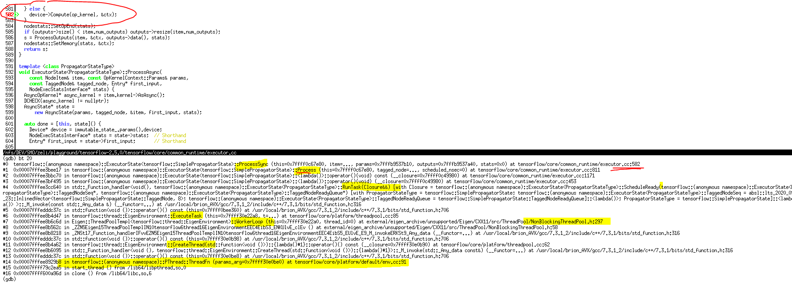
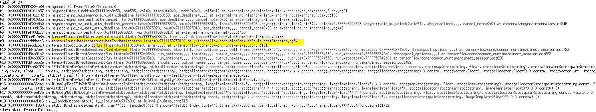

# 下面的callstack显示了一个简单的convolution graph是如何被direct session and executor执行起来的：


```c++
  const bool can_execute_synchronously =
      executors_and_keys->items.size() == 1 && call_timeout == 0;

  if (can_execute_synchronously) {
    PrivateIntraProcessRendezvous rendezvous(device_mgr_.get());
    args.rendezvous = &rendezvous;

    const auto& item = executors_and_keys->items[0];
    set_threadpool_args_for_item(item, &args);
    run_status = item.executor->Run(args);
...
```
因为这是一个简单的graph，无法被partition，故而只有一个executor与其对那个：items只有一个，而且call_timeout=0，因此`can_execute_synchronously`就是true。
当它为true时，TF就会直接调用executor::Run函数，这是一个同步版本，所谓的同步版本也就是在异步版本基础上加上了强制等待：
```c++
  // Synchronous wrapper for RunAsync().
  virtual Status Run(const Args& args) {
    Status ret;
    Notification n;
    RunAsync(args, [&ret, &n](const Status& s) {
      ret = s;
      n.Notify();
    });
    n.WaitForNotification();
    return ret;
  }
```
`RunAsync`的第二个参数是donecallback，这里仅仅是简单的通知主线程时间完成。
在最后的时候donecallback会在Finish中被调用：
```c++
    device->Sync([this, step_id, runner = std::move(runner),
                  done_cb = std::move(done_cb)](const Status& status) mutable {
      delete this;
      runner([step_id, status, done_cb = std::move(done_cb)]() {
        profiler::TraceMeConsumer activity(
            // From TraceMeProducer in KernelAndDeviceFunc::RunAsync,
            // DirectSession::RunInternal or GraphMgr::ExecuteAsync.
            [&] {
              return profiler::TraceMeEncode("ExecutorDoneCallback",
                                             {{"id", step_id}});
            },
            profiler::ContextType::kTfExecutor, step_id,
            profiler::TraceMeLevel::kInfo);
        done_cb(status);
      });
    });
```
Executor::RunAsync调用new一个ExecutorState，然后转调用它的RunAsync函数。上面看到在最后Finish时，`delete this;`就是删除ExecutorState。但是`runner`其实是这个default_runner(local变量，初始化在DirectSession的RunIntel中)
```c++
    default_runner = [pool](Executor::Args::Closure c) {
      pool->Schedule(std::move(c));
    };
```
可以看到最后done_cb是在thread pool中，作为一个task被调用起来的。在device进行同步成功之后，这个done_cb才会被调用。

主线程在等待：

