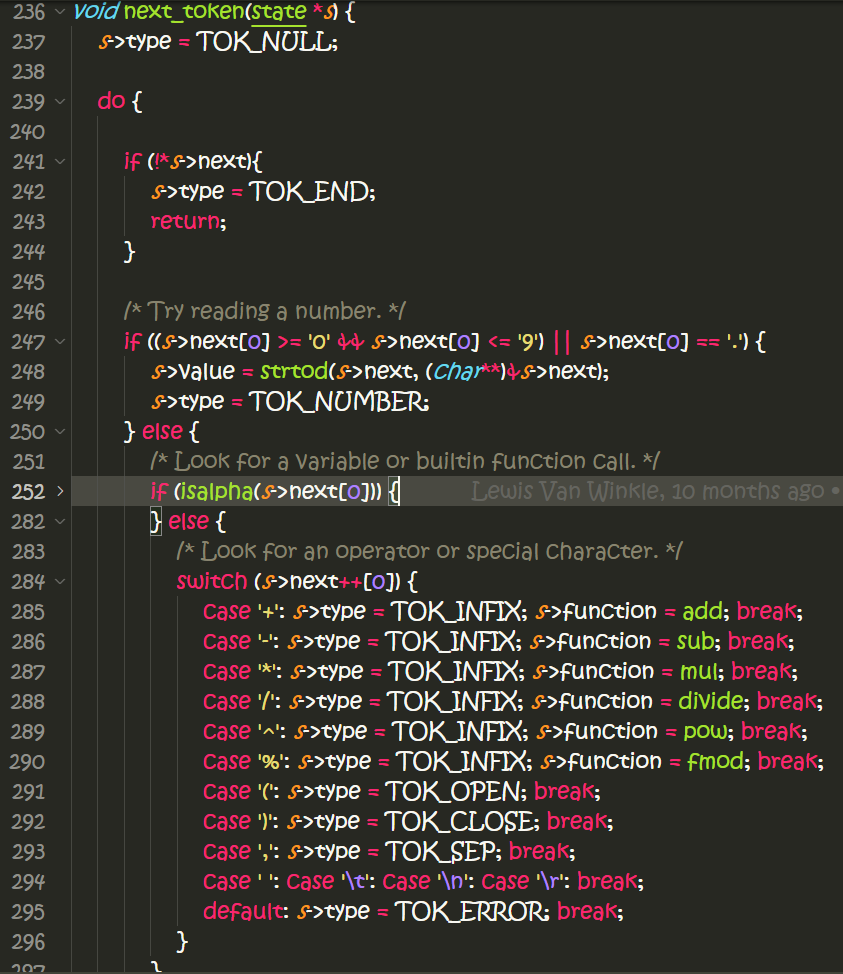
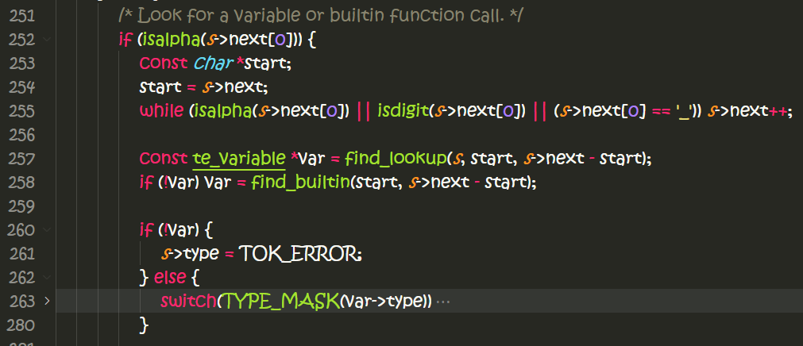

# tinyexpr库的学习

https://github.com/codeplea/tinyexpr.git

- 这是一个解析和评估字符串式数学表达式expression的C库；
- 只提供了4个C API函数；
    ```C
        double te_interp(const char *expression, int *error);
        te_expr *te_compile(const char *expression, const te_variable *variables, int var_count, int *error);
        double te_eval(const te_expr *expr);
        void te_free(te_expr *expr);
    ```
- 采用递归下降解析的方式：`uses a simple recursive descent parser to compile your
expression into a syntax tree`

- 这个库是我一直寻找想要学习的代码

**TinyExpr parses the following grammar:**

    <list>      =    <expr> {"," <expr>}
    <expr>      =    <term> {("+" | "-") <term>}
    <term>      =    <factor> {("*" | "/" | "%") <factor>}
    <factor>    =    <power> {"^" <power>}
    <power>     =    {("-" | "+")} <base>
    <base>      =    <constant>
                   | <variable>
                   | <function-0> {"(" ")"}
                   | <function-1> <power>
                   | <function-X> "(" <expr> {"," <expr>} ")"
                   | "(" <list> ")"


```C++
/* Parses the input expression, evaluates it, and frees it. */
/* Returns NaN on error. */
double te_interp(const char *expression, int *error);

int error;

double a = te_interp("(5+5)", 0); /* Returns 10. */
double b = te_interp("(5+5)", &error); /* Returns 10, error is set to 0. */
double c = te_interp("(5+5", &error); /* Returns NaN, error is set to 4. */
```

`te_interp`
=======
`te_interp`函数的实现如下：
```C++
double te_interp(const char *expression, int *error) {
    te_expr *n = te_compile(expression, 0, 0, error);
    double ret;
    if (n) {
        ret = te_eval(n);
        te_free(n);
    } else {
        ret = NAN;
    }
    return ret;
}
```
- 调用另外3个C-API来完成工作：compile => eval => free；
- compile时出现错误，返回NAN (defined as : 0.0/0.0)；

`te_compile`
==========
那我们来看看`te_compile`的实现：
`te_expr *te_compile(const char *expression, const te_variable *variables, int var_count, int *error);`
- compile从输入表达式字符串开始，支持提供外置的变量；
- 变量可以是正常的数值变量，函数变量；
- 返回一个表达式数据结构指针，代表表达式树结构；

```C++
te_expr *te_compile(const char *expression, const te_variable *variables, int var_count, int *error) {
    state s;
    s.start = s.next = expression;
    s.lookup = variables;
    s.lookup_len = var_count;

    next_token(&s);
    te_expr *root = list(&s);

    if (s.type != TOK_END) {
        te_free(root);
        if (error) {
            *error = (s.next - s.start);
            if (*error == 0) *error = 1;
        }
        return 0;
    } else {
        optimize(root);
        if (error) *error = 0;
        return root;
    }
}
```
`state`结构体定义如下：
```c++
typedef struct state {
    const char *start;
    const char *next;
    int type;
    union {double value; const double *bound; const void *function;};
    void *context;

    const te_variable *lookup;
    int lookup_len;
} state;
```
> 代表当前的解析状态

解析的大头落在了`next_token`函数，下面就是它的框架：

- `s->next`来表当前解析到字符；
- 如果当前是0-9，或者'.' (代表浮点数`.xxxx`)，就以数字来解析；
- 否则如果是`isalpha`，则可以判定为是变量或者函数调用；
- 最后则判断是否是特殊字符, `+`, `-`, `*`, `/`, `^`, `%`, `(`, `)`, `,`, whitespaces;
  - 如何决定操作符的优先级？？？
  ```C++
        /* Look for an operator or special character. */
    switch (s->next++[0]) {
        case '+': s->type = TOK_INFIX; s->function = add; break;
        case '-': s->type = TOK_INFIX; s->function = sub; break;
        case '*': s->type = TOK_INFIX; s->function = mul; break;
        case '/': s->type = TOK_INFIX; s->function = divide; break;
        case '^': s->type = TOK_INFIX; s->function = pow; break;
        case '%': s->type = TOK_INFIX; s->function = fmod; break;
        case '(': s->type = TOK_OPEN; break;
        case ')': s->type = TOK_CLOSE; break;
        case ',': s->type = TOK_SEP; break;
        case ' ': case '\t': case '\n': case '\r': break;
        default: s->type = TOK_ERROR; break;
    }
    ```
    - 数值操作符都对应到一个内置函数：`add`, `sub`, `mul`, `divide`, `pow`, `fmod`；
- 外围是一个循环，如果这次解析成功：`s->type`将不会是`TOK_NULL`，将立即退出；
    - 一次解析结果放入`state`存储：
    - `s->next`表示解析到哪里了；
    - `s->type`表示解析出来的类型；
    - `s->value`表示解析出来的值；
    - `s->function`表示解析出来的函数或闭包类型（带几个参数）；
    - `s->bound`表示解析出来的变量的地址；
    - `s->context`表示解析出来的闭包的上下文;

变量或函数的查找：

- 先查找外面提供的变量/函数;
- 否则查找内置的变量/函数；
```C++
switch(TYPE_MASK(var->type))
{
    case TE_VARIABLE:
        s->type = TOK_VARIABLE;
        s->bound = var->address;
        break;

    case TE_CLOSURE0: case TE_CLOSURE1: case TE_CLOSURE2: case TE_CLOSURE3:         /* Falls through. */
    case TE_CLOSURE4: case TE_CLOSURE5: case TE_CLOSURE6: case TE_CLOSURE7:         /* Falls through. */
        s->context = var->context;                                                  /* Falls through. */

    case TE_FUNCTION0: case TE_FUNCTION1: case TE_FUNCTION2: case TE_FUNCTION3:     /* Falls through. */
    case TE_FUNCTION4: case TE_FUNCTION5: case TE_FUNCTION6: case TE_FUNCTION7:     /* Falls through. */
        s->type = var->type;
        s->function = var->address;
        break;
}
```

以解析来出来的tree的根，调用list函数，继续解析出一个最终的expression:
`te_expr *root = list(&s);`
**list的解析:**
根据语法规则：`<list>      =    <expr> {"," <expr>}`
```C++
static te_expr *list(state *s) {
    /* <list>      =    <expr> {"," <expr>} */
    te_expr *ret = expr(s);

    while (s->type == TOK_SEP) {
        next_token(s);
        ret = NEW_EXPR(TE_FUNCTION2 | TE_FLAG_PURE, ret, expr(s));
        ret->function = comma;
    }

    return ret;
}
```
- 解析当前的`s`代表的表达式；
- 之后如果`s->type`是TOK_SEP： ','，代表还有表达式：逗号表达式；

**表达式的解析：**
根据语法规则：`<expr>      =    <term> {("+" | "-") <term>}`
```C++
static te_expr *expr(state *s) {
    /* <expr>      =    <term> {("+" | "-") <term>} */
    te_expr *ret = term(s);

    while (s->type == TOK_INFIX && (s->function == add || s->function == sub)) {
        te_fun2 t = s->function;
        next_token(s);
        ret = NEW_EXPR(TE_FUNCTION2 | TE_FLAG_PURE, ret, term(s));
        ret->function = t;
    }

    return ret;
}
```
- 如果是+/-操作符，对应到一个函数类型: `te_fun2`；
- 之后将左右term作为这个fun2的左右子树来处理；

**term的解析：**
根据语法规则：`<term>      =    <factor> {("*" | "/" | "%") <factor>}`
```C++
static te_expr *term(state *s) {
    /* <term>      =    <factor> {("*" | "/" | "%") <factor>} */
    te_expr *ret = factor(s);

    while (s->type == TOK_INFIX && (s->function == mul || s->function == divide || s->function == fmod)) {
        te_fun2 t = s->function;
        next_token(s);
        ret = NEW_EXPR(TE_FUNCTION2 | TE_FLAG_PURE, ret, factor(s));
        ret->function = t;
    }

    return ret;
}
```
- 先解析一个factor;
- 再判断是否还有另一个factor：操作符是否是`*`, `/`, `%`？
- 将左右2个factor作为子树节点形成一个func2的节点；

**factor的解析:**
根据语法规则，如果定义是从左到有的顺序：`<factor>    =    <power> {"^" <power>}`
```C++
static te_expr *factor(state *s) {
    /* <factor>    =    <power> {"^" <power>} */
    te_expr *ret = power(s);

    while (s->type == TOK_INFIX && (s->function == pow)) {
        te_fun2 t = s->function;
        next_token(s);
        ret = NEW_EXPR(TE_FUNCTION2 | TE_FLAG_PURE, ret, power(s));
        ret->function = t;
    }

    return ret;
}
```
- 解析方式跟list, term类似；
如果定义是从右到左的顺序: 有点复杂？？？ （==TODO==）

list/term/factor解析方式，假设都是binary operation，都转化为一个func2的实现方式来处理；

**power的解析方式：**
根据语法规则：`<power>     =    {("-" | "+")} <base>`
```C++
static te_expr *power(state *s) {
    /* <power>     =    {("-" | "+")} <base> */
    int sign = 1;
    while (s->type == TOK_INFIX && (s->function == add || s->function == sub)) {
        if (s->function == sub) sign = -sign;
        next_token(s);
    }

    te_expr *ret;

    if (sign == 1) {
        ret = base(s);
    } else {
        ret = NEW_EXPR(TE_FUNCTION1 | TE_FLAG_PURE, base(s));
        ret->function = negate;
    }

    return ret;
}
```
- 这是一个unary operation；
- 最后形成的operation函数是func1类型；

**base的解析：**
根据语法规则：
`<base>      =    <constant> | <variable> | <function-0> {"(" ")"} | <function-1> <power> | <function-X> "(" <expr> {"," <expr>} ")" | "(" <list> ")"`


te_eval
======
当大部分的操作符也转化为函数调用之后，evaluate表达式树将式有个比较简单的事情：
```c++
double te_eval(const te_expr *n) {
    if (!n) return NAN;

    switch(TYPE_MASK(n->type)) {
        case TE_CONSTANT: return n->value;
        case TE_VARIABLE: return *n->bound;

        case TE_FUNCTION0: case TE_FUNCTION1: case TE_FUNCTION2: case TE_FUNCTION3:
        case TE_FUNCTION4: case TE_FUNCTION5: case TE_FUNCTION6: case TE_FUNCTION7:
            switch(ARITY(n->type)) {
                case 0: return TE_FUN(void)();
                case 1: return TE_FUN(double)(M(0));
                case 2: return TE_FUN(double, double)(M(0), M(1));
                case 3: return TE_FUN(double, double, double)(M(0), M(1), M(2));
                case 4: return TE_FUN(double, double, double, double)(M(0), M(1), M(2), M(3));
                case 5: return TE_FUN(double, double, double, double, double)(M(0), M(1), M(2), M(3), M(4));
                case 6: return TE_FUN(double, double, double, double, double, double)(M(0), M(1), M(2), M(3), M(4), M(5));
                case 7: return TE_FUN(double, double, double, double, double, double, double)(M(0), M(1), M(2), M(3), M(4), M(5), M(6));
                default: return NAN;
            }

        case TE_CLOSURE0: case TE_CLOSURE1: case TE_CLOSURE2: case TE_CLOSURE3:
        case TE_CLOSURE4: case TE_CLOSURE5: case TE_CLOSURE6: case TE_CLOSURE7:
            switch(ARITY(n->type)) {
                case 0: return TE_FUN(void*)(n->parameters[0]);
                case 1: return TE_FUN(void*, double)(n->parameters[1], M(0));
                case 2: return TE_FUN(void*, double, double)(n->parameters[2], M(0), M(1));
                case 3: return TE_FUN(void*, double, double, double)(n->parameters[3], M(0), M(1), M(2));
                case 4: return TE_FUN(void*, double, double, double, double)(n->parameters[4], M(0), M(1), M(2), M(3));
                case 5: return TE_FUN(void*, double, double, double, double, double)(n->parameters[5], M(0), M(1), M(2), M(3), M(4));
                case 6: return TE_FUN(void*, double, double, double, double, double, double)(n->parameters[6], M(0), M(1), M(2), M(3), M(4), M(5));
                case 7: return TE_FUN(void*, double, double, double, double, double, double, double)(n->parameters[7], M(0), M(1), M(2), M(3), M(4), M(5), M(6));
                default: return NAN;
            }

        default: return NAN;
    }

}
```
- 除了常量和变量之外，其它操作都转化为函数调用；
- 函数参数计算，递归调用进行评估；
- clouse评估也转化为函数调用，第一个参数是用户提供的context(void*类型);
- te只处理一种数值类型：`double`;


`te_free`
=======
```C++
void te_free_parameters(te_expr *n) {
    if (!n) return;
    switch (TYPE_MASK(n->type)) {
        case TE_FUNCTION7: case TE_CLOSURE7: te_free(n->parameters[6]);     /* Falls through. */
        case TE_FUNCTION6: case TE_CLOSURE6: te_free(n->parameters[5]);     /* Falls through. */
        case TE_FUNCTION5: case TE_CLOSURE5: te_free(n->parameters[4]);     /* Falls through. */
        case TE_FUNCTION4: case TE_CLOSURE4: te_free(n->parameters[3]);     /* Falls through. */
        case TE_FUNCTION3: case TE_CLOSURE3: te_free(n->parameters[2]);     /* Falls through. */
        case TE_FUNCTION2: case TE_CLOSURE2: te_free(n->parameters[1]);     /* Falls through. */
        case TE_FUNCTION1: case TE_CLOSURE1: te_free(n->parameters[0]);
    }
}


void te_free(te_expr *n) {
    if (!n) return;
    te_free_parameters(n);
    free(n);
}
```
- 根据表达式树，采用后序遍历树的方式；
- 先释放子树节点，然后释放当前节点；
- 子树节点释放，是先右边子树，后左右子树，与评估的方式正好相反；
