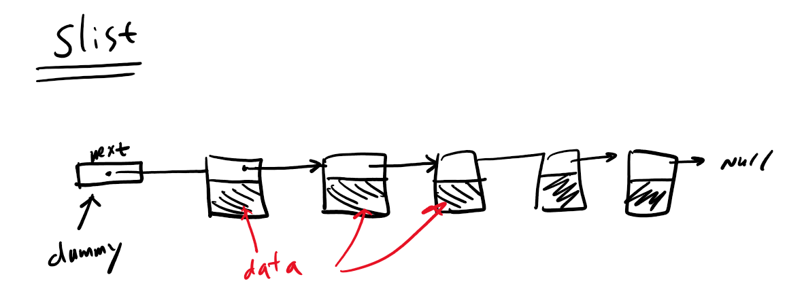

# slist的学习和研究

文件列表：
- stl_slist.h

### `slist`类
这个类是个模板类，继承于基类模板类`_Slist_base`，模板参数就是数据类型和内存分配器类型，与其它容器类型定义保持一致，当时它还不属于C++标准规定的容器类型。单链表容器类型。

提炼出一个node_base类：它只包含一个指向下一个节点的指针。
```CPP
struct _Slist_node_base
{
  _Slist_node_base* _M_next;
};
```
然后node类继承于这个基类：
```CPP
template <class _Tp>
struct _Slist_node : public _Slist_node_base
{
  _Tp _M_data;
};
```
**为啥要这样设计？**
这样设计的原因在于slist设计有一个哨兵头节点，它的next指针指向的才是单链表的第一个节点，这样的设计可以去除判断头节点为空或存在的判断逻辑。但是如果将这个哨兵节点设计为只包含一个 next域的节点，可以进一步节省一个sizeof(_Tp)的内存空间，要知道这个size可能比较大。


```CPP {.numberLines}
template <class _Tp, class _Alloc>
struct _Slist_base {
  typedef _Alloc allocator_type;
  allocator_type get_allocator() const { return allocator_type(); }

  _Slist_base(const allocator_type&) { _M_head._M_next = 0; }
  // 基类析构会销毁所有串联的节点(销毁 => 回收内存)，
  // 初步猜测第2个参数是停止节点的判断(如果after节点是null，则停止)
  ~_Slist_base() { _M_erase_after(&_M_head, 0); }

protected:
  typedef simple_alloc<_Slist_node<_Tp>, _Alloc> _Alloc_type;
  _Slist_node<_Tp>* _M_get_node() { return _Alloc_type::allocate(1); }
  void _M_put_node(_Slist_node<_Tp>* __p) { _Alloc_type::deallocate(__p, 1); }

  _Slist_node_base* _M_erase_after(_Slist_node_base* __pos)
  {
    _Slist_node<_Tp>* __next = (_Slist_node<_Tp>*) (__pos->_M_next);
    _Slist_node_base* __next_next = __next->_M_next;  // 并没有判断__next是否为null
    __pos->_M_next = __next_next;
    destroy(&__next->_M_data);  // 一般是显式调用析构函数
    _M_put_node(__next);  // 回收内存
    return __next_next;
  }
  _Slist_node_base* _M_erase_after(_Slist_node_base*, _Slist_node_base*);

protected:
  _Slist_node_base _M_head;  // 基类保有这个哨兵节点
};
```
这个就是它的处理逻辑：
```CPP {.numberLines}
template <class _Tp, class _Alloc>
_Slist_node_base*
_Slist_base<_Tp,_Alloc>::_M_erase_after(_Slist_node_base* __before_first,
                                        _Slist_node_base* __last_node) {
  _Slist_node<_Tp>* __cur = (_Slist_node<_Tp>*) (__before_first->_M_next);
  while (__cur != __last_node) {
    _Slist_node<_Tp>* __tmp = __cur;
    __cur = (_Slist_node<_Tp>*) __cur->_M_next;
    destroy(&__tmp->_M_data);
    _M_put_node(__tmp);
  }
  __before_first->_M_next = __last_node;
  return __last_node;
}
```

* 经典的父子类迭代器设计，基类不是类模板:
```CPP {.numberLines}
struct _Slist_iterator_base
{
  typedef size_t               size_type;
  typedef ptrdiff_t            difference_type;
  typedef forward_iterator_tag iterator_category;

  _Slist_node_base* _M_node;

  _Slist_iterator_base(_Slist_node_base* __x) : _M_node(__x) {}
  void _M_incr() { _M_node = _M_node->_M_next; }

  bool operator==(const _Slist_iterator_base& __x) const {
    return _M_node == __x._M_node;
  }
  bool operator!=(const _Slist_iterator_base& __x) const {
    return _M_node != __x._M_node;
  }
};
```
* 子类迭代器类定义为类模板：
```CPP {.numberLines}
template <class _Tp, class _Ref, class _Ptr>
struct _Slist_iterator : public _Slist_iterator_base
{
  typedef _Slist_iterator<_Tp, _Tp&, _Tp*>             iterator;
  typedef _Slist_iterator<_Tp, const _Tp&, const _Tp*> const_iterator;
  typedef _Slist_iterator<_Tp, _Ref, _Ptr>             _Self;

  typedef _Tp              value_type;
  typedef _Ptr             pointer;
  typedef _Ref             reference;
  typedef _Slist_node<_Tp> _Node;

  _Slist_iterator(_Node* __x) : _Slist_iterator_base(__x) {}
  _Slist_iterator() : _Slist_iterator_base(0) {}
  _Slist_iterator(const iterator& __x) : _Slist_iterator_base(__x._M_node) {}

  // 这里用了强制转换，是安全的
  reference operator*() const { return ((_Node*) _M_node)->_M_data; }
#ifndef __SGI_STL_NO_ARROW_OPERATOR
  pointer operator->() const { return &(operator*()); }
#endif /* __SGI_STL_NO_ARROW_OPERATOR */

  _Self& operator++()
  {
    _M_incr();
    return *this;
  }
  _Self operator++(int)
  {
    _Self __tmp = *this;
    _M_incr();
    return __tmp;
  }
};
```
基类和子类模板继承设计，好处在于可以减少子类实例化后产生的代码量。因为如果所有的函数都定义在子类模板中（没有父类），子类模板所有的成员函数在子类实例化时都会被实例化一份，无形中增加了最后编译出来的代码量，而这些成员函数与子类实例化时的具体类型没有关系。这时就可以将它们提取到一个基类中。
