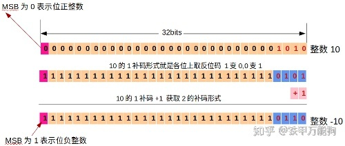

# 第1篇:C/C++ 内存中的数据表示

负整数如何存储在内存中？
计算机使用特殊机制来存储负数，这是2的补码格式: 2's complement
我们得先知道1的数字补码：
1的数字补码只是反转实际数字的二进制位。10 => 01
> 补码： 要求某个数m对另一个数n的补码，在数学上可以理解位`n-m` : m差n还有多少；
那么1 的数字补码就是: 0 差1还有1， 故0的补码就是1, 1差1是0，所以1相对于1的补码就是0;

那么类似的，2的数字补码：
1相对于2的数字补码就是2-1 = 1，0相对于2的数字补码就是2-0 = 2，但是只能用0/1来表示某一位，所有这里就是0.
00 => 00
01 => 11
10 => 10
11 => 01
=> 1的数字补码之后（取反），+1获得2的数字补码；
这样的话，我的理解好像不太对. ==TODO==

