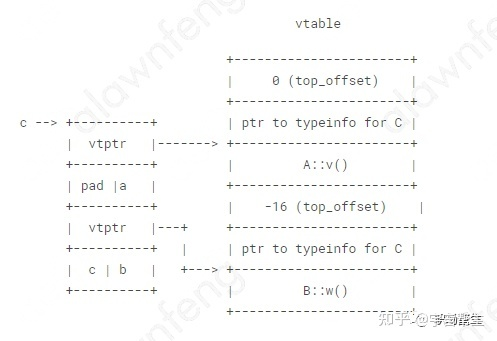

# c++ memory model


link: https://zhuanlan.zhihu.com/p/368901281

> C++11引入memory model的意义在于我们可以在high level language层面实现对在多处理器中多线程共享内存交互的控制。我们可以在语言层面忽略compiler，CPU arch的不同对多线程编程的影响了。我们的多线程可以跨平台。
>

C++对象构造顺序？
1. 构造子类构造函数的参数
2. 子类调用基类构造函数
3. 基类设置vptr
4. 基类初始化列表内容进行构造
5. 基类函数体调用
6. 子类设置vptr
7. 子类初始化列表内容进行构造
8. 子类构造函数体调用

为什么虚函数会降低效率？
===
是因为虚函数调用执行过程中会跳转两次，首先找到虚函数表，然后再查找对应函数地址，这样CPU指令就会跳转两次，而普通函数指跳转一次，CPU每跳转一次，预取指令都可能作废，这会导致分支预测失败，流水线排空，所以效率会变低。
设想一下，如果说不是虚函数，那么在编译时期，其相对地址是确定的，编译器可以直接生成jmp/invoke指令；
==**如果是虚函数，多出来的一次查找vtable所带来的开销，倒是次要的，关键在于，这个函数地址是动态的，譬如 取到的地址在eax里，则在call eax之后的那些已经被预取进入流水线的所有指令都将失效。流水线越长，一次分支预测失败的代价也就越大。**==

C++栈内存空间模型
===

1. 当主函数调用子函数的时候：
- 在主函数中，将子函数的参数按照一定调用约定(参考调用约定），一般是从右向左把参数push到栈中；
- 然后把下一条指令地址，即返回地址（return address）push入栈（隐藏在call指令中）；
- 然后跳转到子函数地址处执行：call 子函数；此时
2. 子函数执行：
- push %rbp : 把当前rbp的值保持在栈中；
- mov %rsp， %rbp：把rbp移到最新栈顶位置，即开启子函数的新帧；
- [可选]sub $xxx, %esp: 在栈上分配XXX字节的临时空间。（抬高栈顶）(编译器根据函数中的局部变量的总大小确定临时空间的大小);
- [可选]push XXX: 保存（push）一些寄存器的值;
3. 子函数调用返回：
- 保持返回值：一般将函数函数值保持在eax寄存器中；
- [可选]恢复（pop）一些寄存器的值；
- mov %rbp,%rsp: 收回栈空间，恢复主函数的栈顶；
- pop %rbp；恢复主函数的栈底；

std::allocator的分配算法


C++对象内存模型
===
1. 空类对象 （一般作为模板的tag来使用）：
```c++
class A { };
sizeof(A) = 1
```
> c++标准规定C++对象大小不能为0，在内存里面要有唯一的地址；


2. 非空类
```c++
class A {
public:
    int a;
};
sizeof(A) = 8, align = 8
```


3. 非空虚基类
```c++
class A {
public：
    int a;
    virtual void v();
};
sizeof(A) = 16, align = 8
```


4. 单继承
```c++
class A {
public:
    int a;
    virtual void v();
};
class B : public A {
public:
    int b;
};
sizeof(B) = 16, align = 8
```


5. 简单多继承
```c++
class A {
public:
    int a;
    virtual void v();
};
class B {
public:
    int b;
    virtual void w();
};
class C : public A, public B {
public:
    int c;
};
sizeof(C) = 32, align = 8
```

https://godbolt.org/ 输出：
```assembly
vtable for C:
  .quad 0
  .quad typeinfo for C
  .quad A::v()
  .quad -16
  .quad typeinfo for C
  .quad B::w()
vtable for B:
  .quad 0
  .quad typeinfo for B
  .quad B::w()
vtable for A:
  .quad 0
  .quad typeinfo for A
  .quad A::v()
```

6. 简单多继承-2
```c++
class A {
public:
    int a;
    virtual void v();
};
class B {
public:
    int b;
    virtual void w();
};
class C : public A, public B {
public:
    int c;
    virtual void w();
};
sizeof(C) = 32, align = 8
```


7. The diamond：多重继承(没有虚继承)
```c++
class A {
public:
    int a;
    virtual void v();
};
class B : public A {
public:
    int b;
    virtual void w();
};
class C : public A {
public:
    int c;
    virtual void x();
};
class D : public B, public C {
public:
    int d;
    virtual void y();
};
sizeof(D) = 40, align = 8
```


8. The diamond: 钻石类虚继承
```c++
class A {
public:
    int a;
    virtual void v();
};
class B : public virtual A {
public:
    int b;
    virtual void w();
};
class C : public virtual A {
public:
    int c;
    virtual void x();
};
class D : public B, public C {
public:
    int d;
    virtual void y();
};
sizeof(D) = 48, align = 8
```


1. top_offset 表示this指针对子类的偏移，用于子类和继承类之间dynamic_cast转换（还需要typeinfo数据），实现多态，
2. vbase_offset 表示this指针对基类的偏移，用于共享基类；
3. gcc为了每一个类生成一个vtable虚函数表，放在程序的.rodata段，其他编译器（平台）比如vs，实现不太一样.
