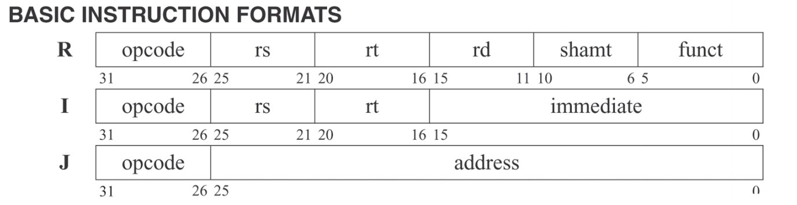
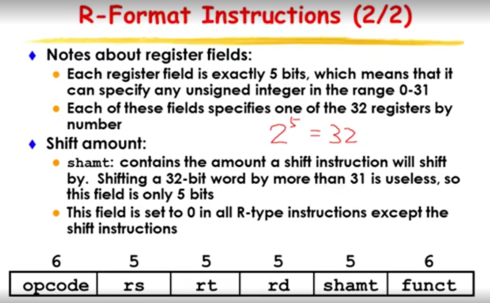
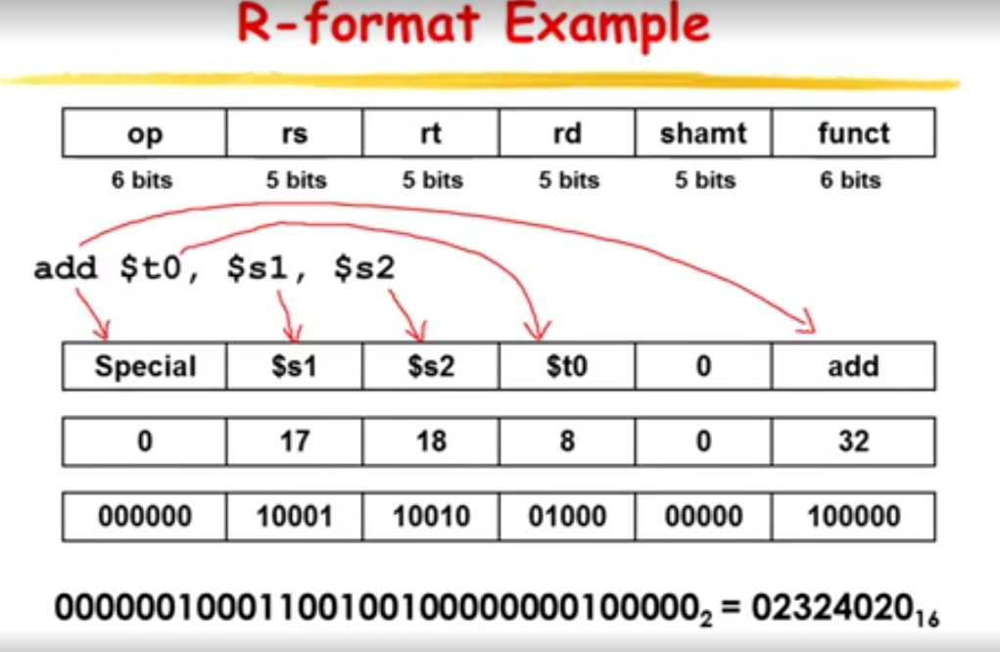
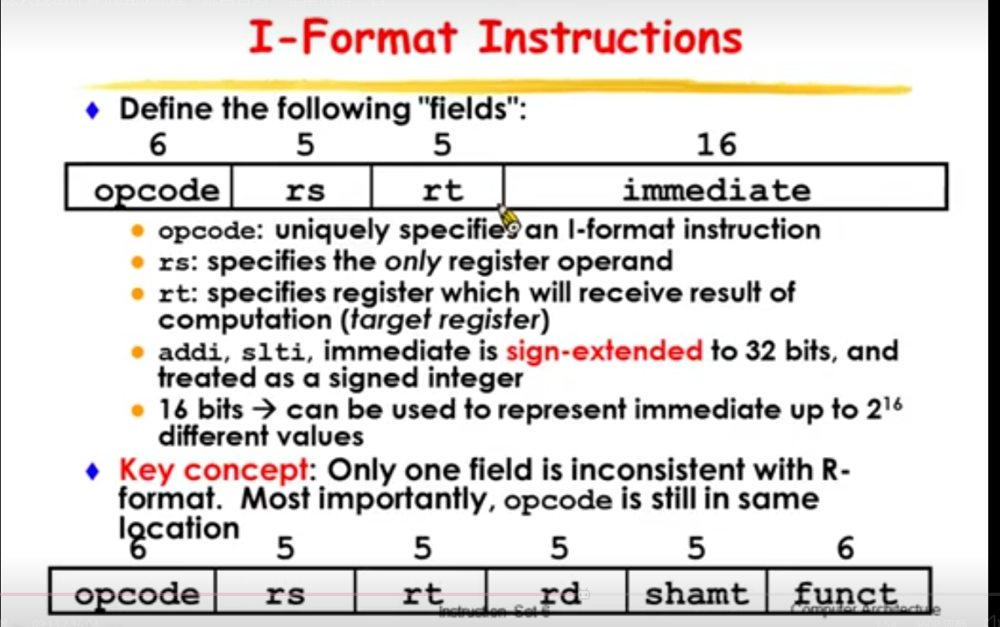
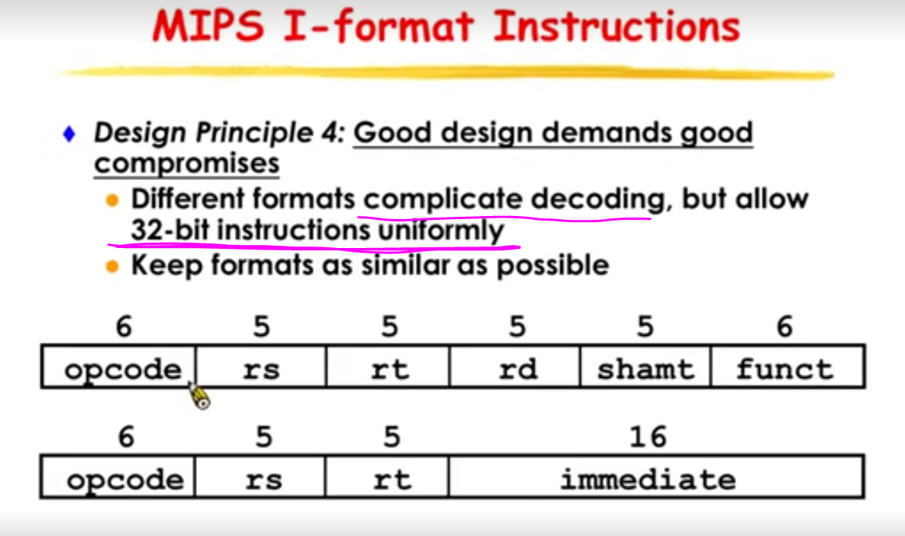
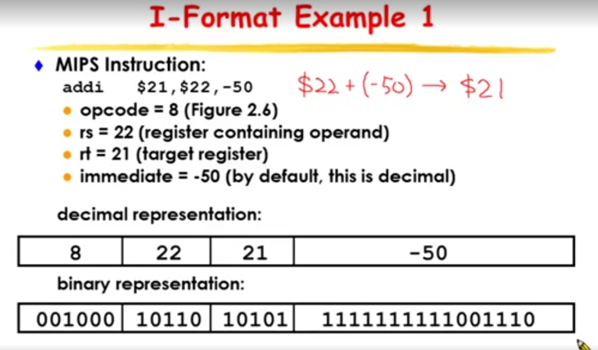
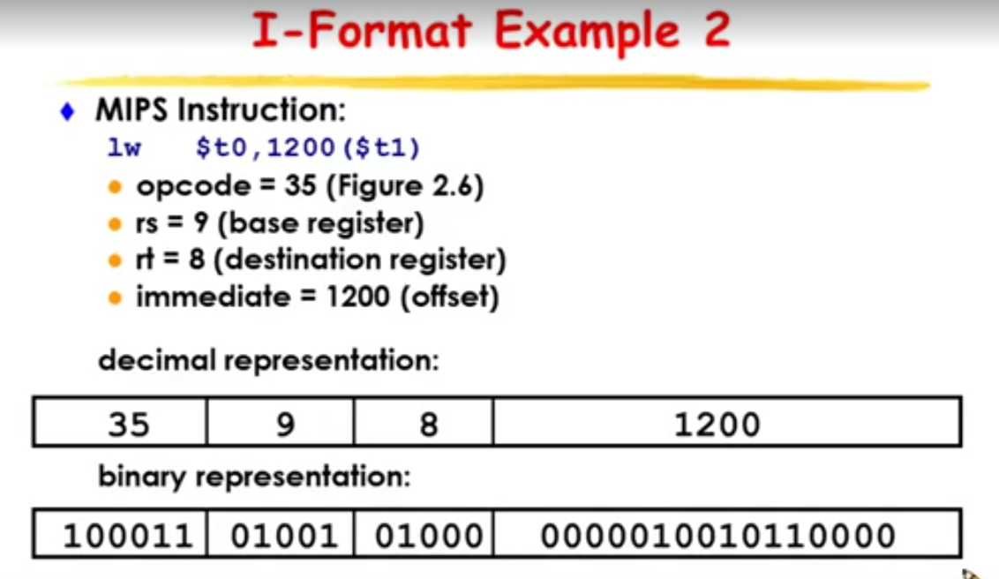
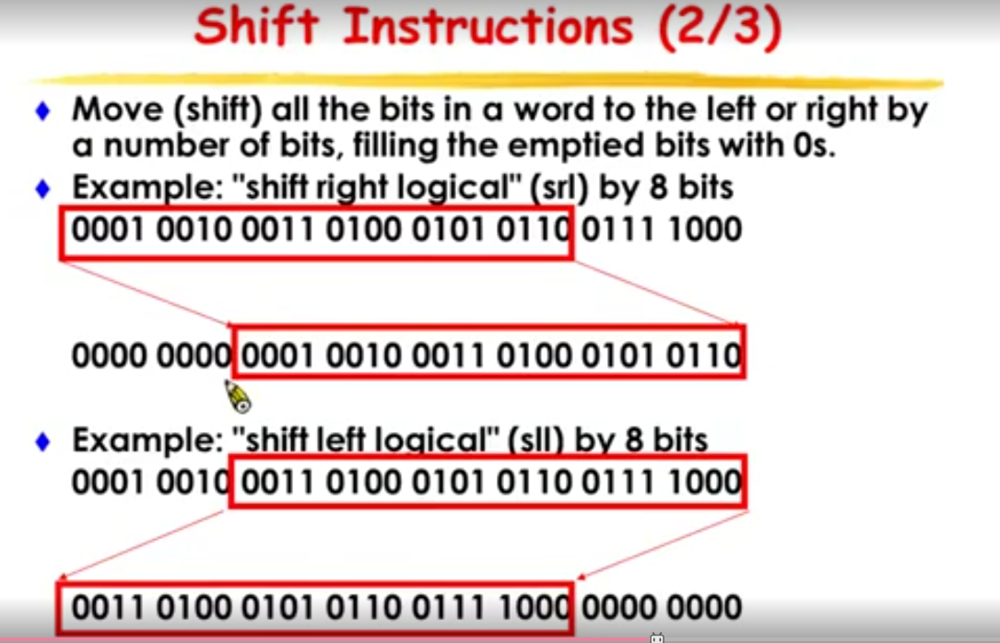
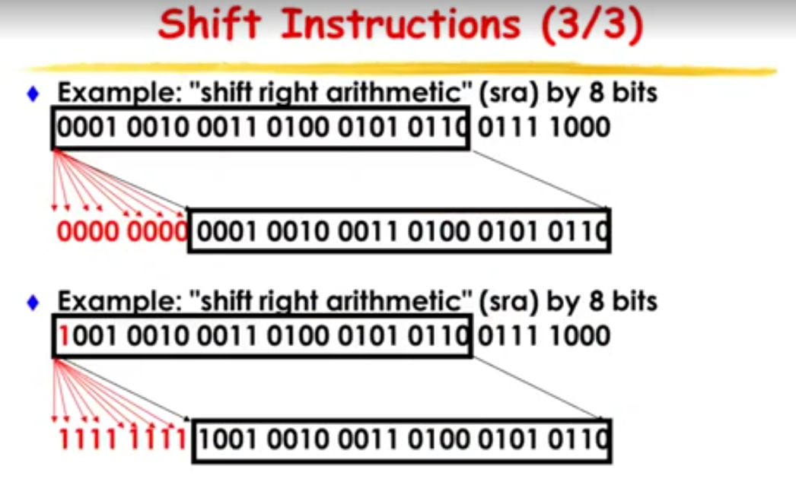
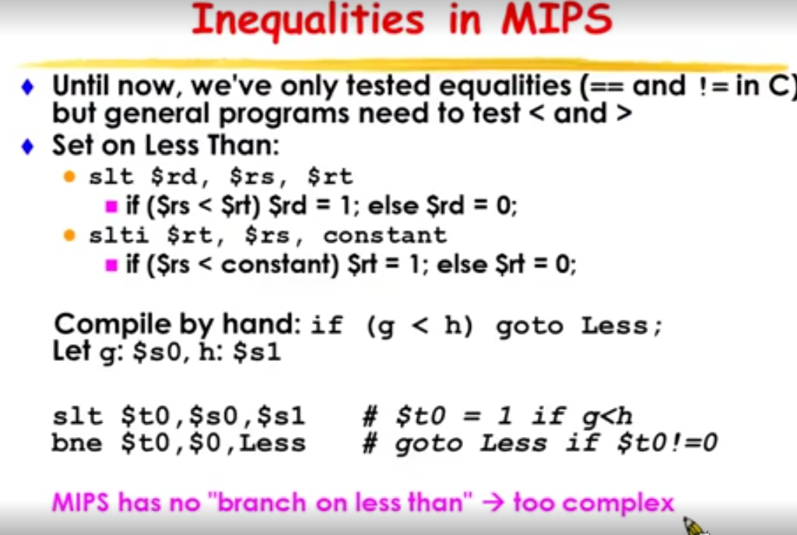

# MIPS instruction

Why are 'opcode' field and 'funct' field apart in MIPS?
===
Question?
MIPS ISA has an R type instruction, and the R instruction has an opcode field at its first 6 bits and a funct field at its last 6 bits. So why are the ISA designed like this? How about combine them into a 12-bits field?

Answer:
Because all instructions must decode starting from a common point. A 12 bit opcode would chew too many bits for other non-R types which use them for other things. (e.g.) the j and jal instructions use the remaining bits to specify the address (i.e. no funct field). After decoding the opcode, each instruction is free to interpret the remaining 26 bits in any way. immediate insts (e.g. ori) use the last 6 as part of the 16 bit immediate operand

My idea is that the three kinds of instructions share a prefix of 6-bit opcode. And for R and I types, the next 5 bits decide source register. If we combine opcode and funct for R instruction, the instruction format is not so consistent between R and I, which may make processor's design complex.

简单来说，就是用12bits来描述opcode会在一些指令中浪费太多空间，本可以用那些bit来描述更有用的信息，比如I指令中的立即数，这样的话，就可以存储更大的立即数。而且2^12可以最多表示4k的指令，好像也没有那么多指令需要支持。

