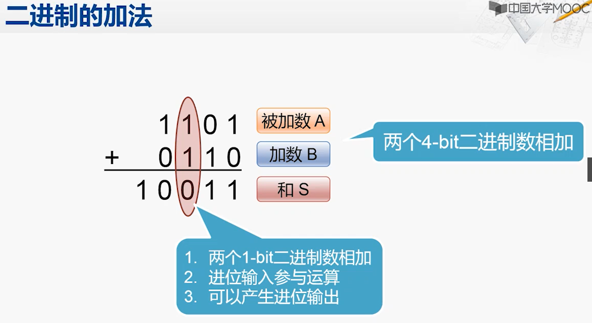

**利用逻辑操作实现加法，真是巧妙**
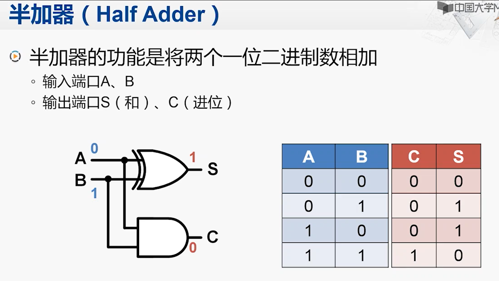
A+B 可以改写成（1位运算）:
* S = A ^ B => 加和结果；
* C = A & B => 进位结果；

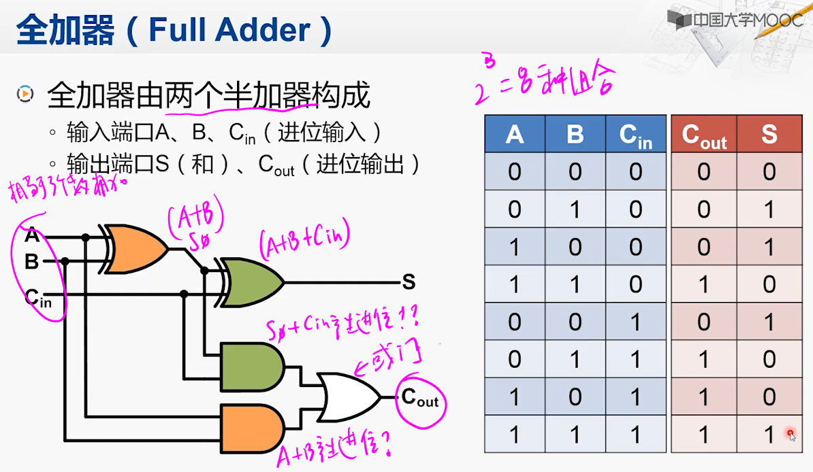
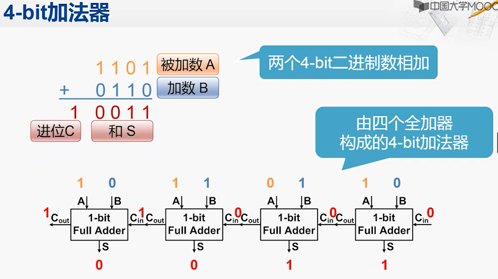
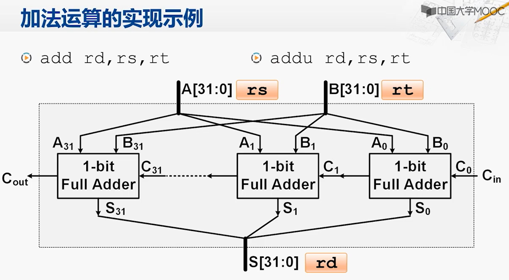

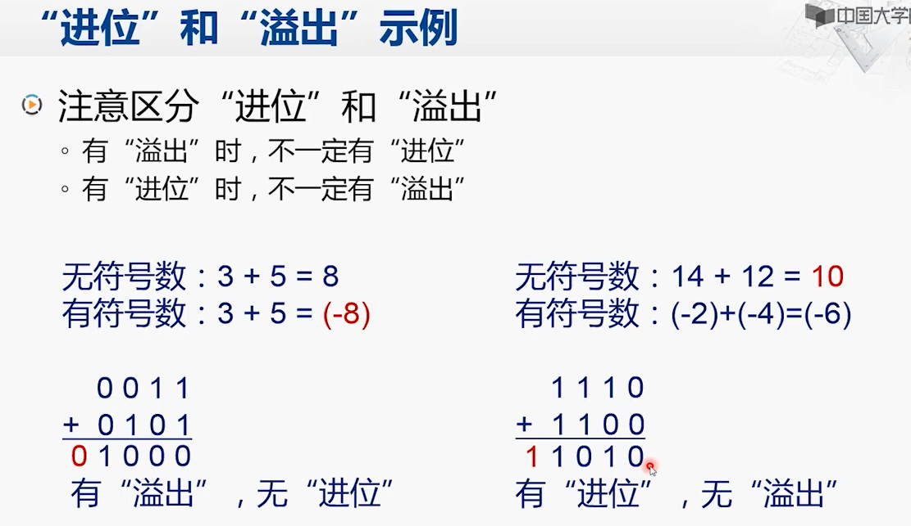
溢出是针对有符号数来说的。
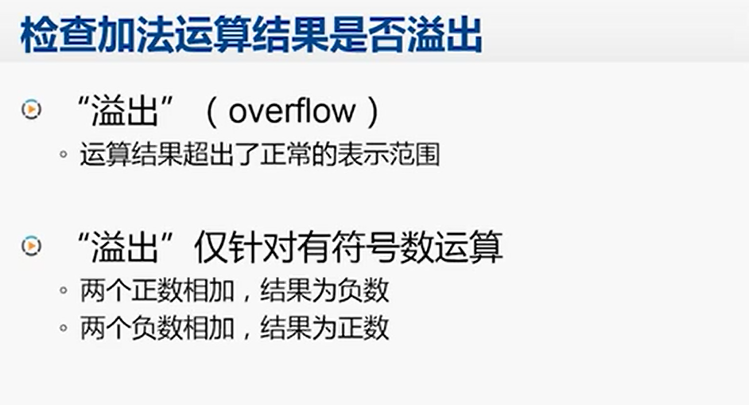

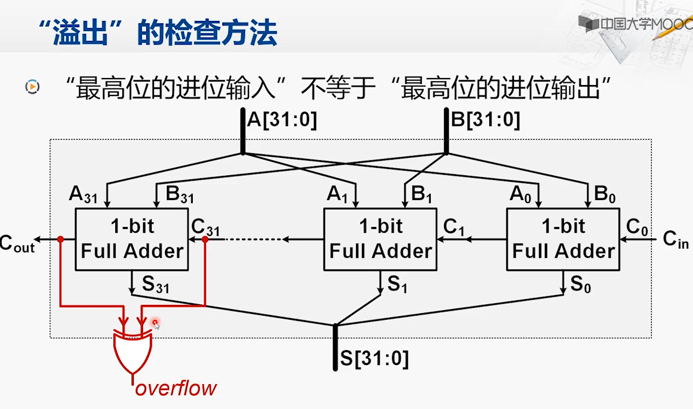
加法运算不区分有符号数和无符号数，全都是通过上面一套加法器来实现，按位进行相加。

MIPS根据溢出是否要处理，分为两个指令。
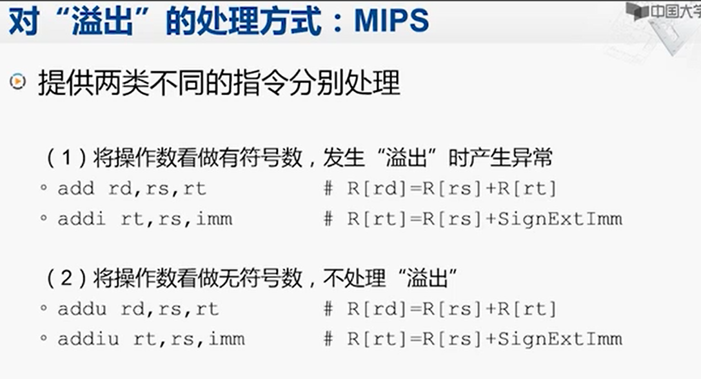
x86根据溢出标志位来检测是否发生了溢出。
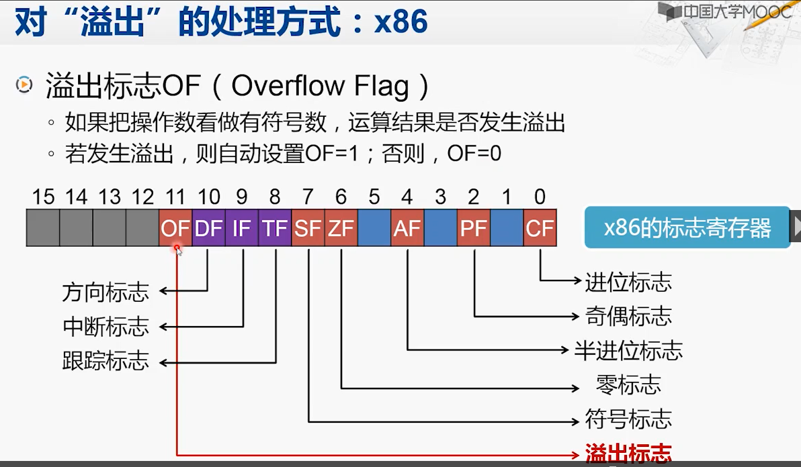

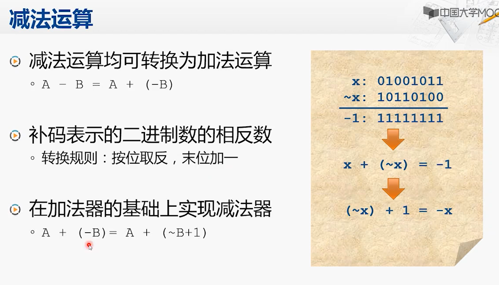
联想到-B AND A，-B跟A进行按位与操作，其实是做**ALIGN DOWN**
如果B是一个只有1bit的数值:
```sh
 B:      0001 0000
-B:      1111 0000
~B + 1 : 1110 1111 + 1 => 1111 0000
-B AND A: 等价于将A的低4bits消零
```

利用加法器来实现减法很巧妙：
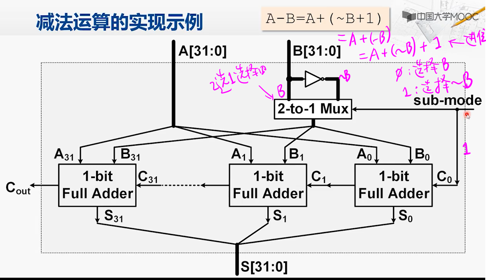
