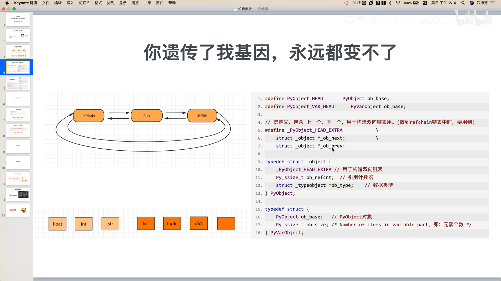

# Python垃圾回收--引用计数器

引用计数器
===
1. 环状双向链表(refchain)
在python程序中创建的任何对象都会被放在refchain链表中。
**float，int，str，list，tuple，dict，etc**

```python
name = 'tim`
age = 18
hobby = ['篮球', '美女']
```
内部会创建一些==通用==数据[上一个对象，下一个对象，类型，引用个数]
\# name = 'tim'

```c++
#define _PyObject_HEAD_EXTRA \
    struct _object* _ob_next; \
    struct _object* _ob_prev;

typedef struct _object {
    _PyObject_HEAD_EXTRA
    Py_ssize ob_refcnt;
    struct _typeobject* ob_type;
} PyObject;
```



在C源码中，用`PyObject`来体现每个对象中都有的相同的值。
在C源码中，用`PyVarObject`来体现有多个元素的每个对象中都有的值：`PyObject` + `Py_ssize`。

2. 类型封装结构体
* float类型
===
```c++
typedef struct {
    PyObject_HEAD  // = PyObject
    double ob_fval;
} PyFloatObject;
```

* int类型
===
```c++
struct _longobject {
    PyObject_VAR_HEAD  // 注意这里是var object
    digit ob_digit[1];
};
// long (arbitrary precision) integer object interface
typedef struct _longobject PyLongObject;
```

* list类型
===
```c++
typedef struct {
    PyObject_VAR_HEAD
    PyObject** ob_item;
    Py_ssize_t allocated;
} PyListObject;
```

* tuple类型
===
```c++
typedef struct {
    PyObject_VAR_HEAD
    PyObject* ob_item[1];
} PyTupleObject;
```

* dict类型
===
```c++
typedef struct {
    PyObject_VAR_HEAD
    Py_ssize_t ma_used;
    PyDictKeysObject* ma_keys;
    PyObject** ma_values;
} PyDictObject;
```

3. 引用计数器
当python程序运行时，会根据数据类型的不同找到其对应的结构体，根据结构体中的字段来创建相关的数据，然后将对象添加到refchain双向链表中。
在C源码中有两个关键的结构体：`PyObject`和`PyVarObject`。
每个对象中有ob_refcnt就是引用计数器，值默认为1，当有其它变量引用对象中，引用计数器就会发生变化。
   * 引用
    ```python
    a = 9999
    b = a  # refcnt (a) = refcnt (b) = 2
    ```
   * 删除引用
    ```python
    a = 9999
    b = a
    del b  # refcnt (a) = 1
    ```
