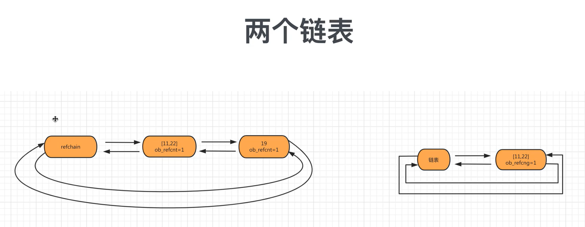

# Python垃圾回收---循环引用

循环引用
```python
v1 = [11, 22, 33]
v2 = [44, 55, 66]
v1.append(v2) # 引用计数器为2
v2.append(v1) # 引用计数器为2

del v1 # 引用计数器-1
del v2 # 引用计数器-1
```

**标记清除**
目的: 为了解决引用计数器循环引用的不足
实现：在python的底层，再维护一个链表，链表中专门放那些可能存在循环引用的对象(list/tuple/dict/set)。

在python内部，某种情况下，会去扫描可能存在循环引用的链表的每个元素，检查是否有循环引用，如果有则让双方的引用计数器-1：如果是0则垃圾回收。
